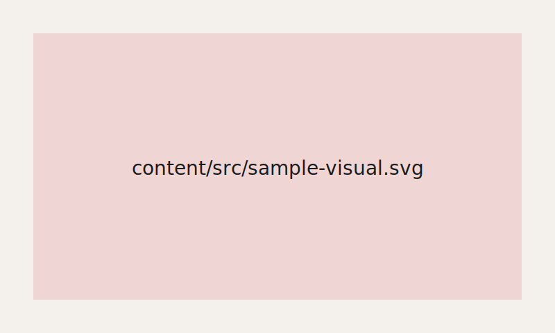

# Example Case Study

A short intro for the collection hero. Each `##` below becomes its own poster card — same rules as MD Gallery.

## Context

This portfolio reads Markdown from the `content/` folder. Images next to your files live in `content/src/` and are referenced with relative paths:

## Process

- Write case studies as `.md` files under `content/`
- Put images in `content/src/` (or `content/your-project/src/` if you prefer per-project folders)
- Run `npm start` to refresh the homepage index from your markdown files (see `content/CONTENT.md`)

## Outcome

Run `npm start` and open the local URL. No file picker, no uploads — visitors browse your case studies from the homepage grid.
