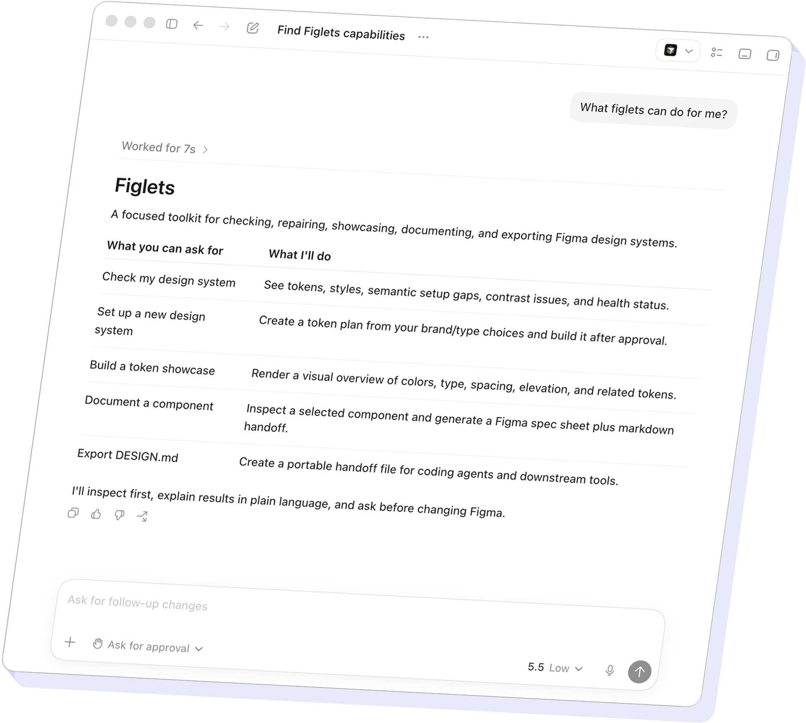
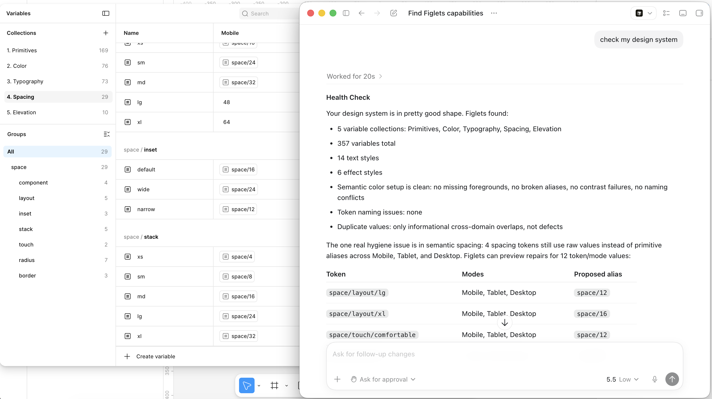
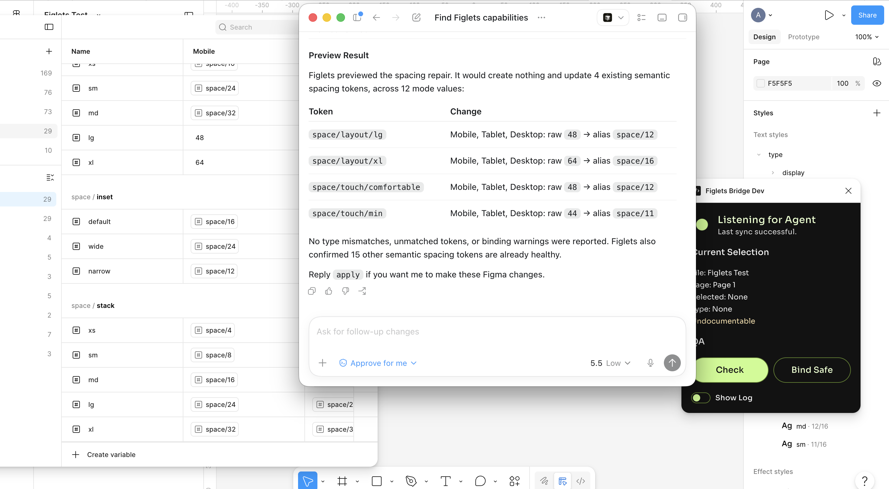
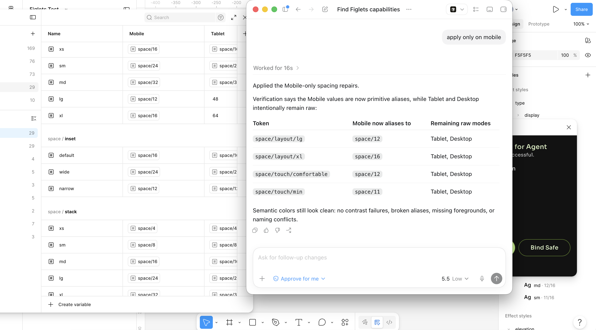

# Figlets MCP

An AI interface for managing Figma design systems through plain language. It helps designers audit components, document decisions, and run repeatable QA without relying on slow, fragile, manual workflows.

| AI hosts | Core workflows | Writes gated |
|---:|---:|:---:|
| 6+ | 7 | 100% |

## Overview

Design systems rarely break all at once. They drift.

Token names become inconsistent. Contrast issues sit there quietly. Variables get duplicated. Teams keep shipping, but the system becomes harder to trust every sprint.

Figlets MCP is my attempt to solve that in a practical way.

The AI is the interface. Figlets is the engine. Designers can ask for what they need in plain language. Figlets runs the structured work locally, explains what it found, and asks before anything changes in Figma.

[Figlets MCP on Github](https://github.com/arashr/figlets-mcp)

## The Problem

I first built [Figlets as Claude-only skills](https://github.com/arashr/figlets). It worked, but the model was doing too much.

That made the output fragile. The agent could calculate contrast correctly, but it could also get it wrong. It could pick the right token alias, or invent one. It could explain a fix clearly, or jump ahead and make assumptions.

That is fine for a demo. It is not fine for a production design system.

The main problem was not “can AI help?” It was “what should AI be allowed to decide?”

## The Product Split

The rebuild started with a cleaner contract.

**Code handles the reliable work.** Contrast math, alias selection, token-gap detection, repair planning, and validation.

**The agent handles the human layer.** Intent, explanation, missing context, repair choices, and approval.

**The Figma bridge handles the live file.** Approved changes go through Figma Desktop, not a hidden cloud process.

This split made the product more predictable. The agent could guide the designer, but it could not freestyle over the file.

## AI as Interface

The bigger product idea behind Figlets is AI as interface.

Traditional software interfaces are powerful, but they are also rigid. They expect users to know where to go, what setting to change, and what input the system needs. If users do not understand the structure of the tool, they get stuck. If the tool does not support the path they need, the flow ends.

AI changes that model.

The user can start with intent instead of navigation. They can say what they want in plain language, even if they do not know the method yet. The agent can translate that intent into the right workflow, ask for missing context, explain errors, and turn dead ends into next steps.

That is how I see Figlets. The AI is not there to freely edit Figma. It is there to make a structured system easier to use. The agent listens, guides, explains, and asks. Figlets does the reliable work underneath.

## Product Vision

> I tell the agent what I want in plain language. It checks my Figma file, explains what it found, tells me what can be fixed, asks before changing anything, runs the reliable tools, verifies the result, and suggests the next useful step.

Figlets is not a chatbot that edits Figma freely. That would be risky and too vague.

It is a local-first design system toolkit with a conversational interface on top. The interface is flexible. The execution is controlled.

## Designing for Trust

The hardest design problem was trust.

For designers to use AI on a real Figma file, the product needs clear boundaries. Figlets can inspect, explain, and recommend. But it does not silently change the file.

Every write path starts read-only. First it syncs the file. Then it audits the system. Then it explains the findings. Only after that does it offer repairs.

The designer always sees what will change before anything is applied.

## Approval Boundaries

Approval has to match intent.

If a designer approves fixing four Mobile spacing aliases, Figlets should not create Tablet and Desktop modes in the background. That may look helpful from the system side, but it breaks trust from the designer side.

So repairs are grouped by scope. Foundation repairs, primitive updates, and semantic token writes each need separate approval.

After a repair is applied, Figlets syncs the file again, checks the result, and stops. It does not move into the next category unless the designer asks.

The repair menus use designer language too. “Fix the 4 spacing alias repairs” is better than exposing internal commands. It keeps the user focused on the decision, not the tool name.

## Knowing When Not to Decide

Some findings are real, but they should not be auto-fixed.

For example, `color/text/danger` and `color/text/on-danger` can look like duplicates. But they may represent different usage contexts. One could be normal danger text. The other could be text on a danger surface.

Figlets explains the conflict and asks the designer to choose the direction. It does not delete or rename variables just because they look similar.

Accessibility follows the same rule. If a suggested repair would fail contrast, Figlets does not show it as a one-click fix. The default path should not recommend bad accessibility decisions.

## Agent Interface

At first, the interface was scattered across prompts, adapter docs, and tool descriptions. Strong agents could handle it. Weaker agents exposed the cracks.

They dumped JSON. They skipped steps. They wrote ad hoc scripts over local snapshots.

That showed me the interface was not just the chat box. It was the contract between the designer, the agent, and the local tools.

So I built an Agent Interface exposed through MCP:

- `figlets_start` introduces what Figlets can do.
- `figlets_route_intent` maps a plain request to the right workflow.
- `figlets_workflow_guide` gives step-by-step instructions with approval gates built in.

If the designer already states a goal, Figlets routes directly. If the request is unclear, it offers a structured choice instead of guessing.

## Core Workflows

**Check my design system**  
Syncs the file, audits tokens, checks semantic gaps, finds hygiene issues, ranks findings, and ends with a repair menu.

**Set up a new design system**  
Bootstraps variables and foundations from config. Intake questions come before token suggestions.

**Build a token showcase**  
Creates a visual reference frame in Figma for colors, typography, spacing, radius, and elevation.

**Document a component**  
Creates a handoff spec from the selected component with safer binding logic.

**Export DESIGN.md**  
Creates a portable design document for coding agents and cross-team handoff.

**Token-gap completion**  
Finds missing config-backed tokens and plans repairs with separate approval paths.

**QA binding audit**  
Checks component variable bindings in read-only mode and groups issues by fixability.

## From Skill Set to Product

The first version was useful, but it was not a product yet. It depended on one AI host and had fuzzy boundaries.

The MCP rebuild turned it into a clearer system:

- `figlets-core` handles analysis.
- `figlets-mcp-server` exposes stable tools.
- `figma-bridge-plugin` connects approved actions to the live Figma file.

The product decisions shaped the architecture.

Reports are written for conversation, not direct apply. Repair plans separate required, optional, and missing-capability items. Setup detects installed AI apps and writes MCP config, so designers do not need to edit JSON.

The Figma bridge uses a development import flow because localhost access is not allowed for Community-published plugins. It is not ideal, but it is honest. The product explains the tradeoff instead of hiding it.

## Iteration

I tested Figlets on real Figma files and weaker models on purpose. Strong models can hide bad product design. Weaker models expose it.

A few things changed through testing:

- Health checks now include token-gap findings in the first audit.
- Mobile-only spacing repairs no longer expand into wider foundation changes.
- Contextual roles like `on-fill-*` are no longer treated as simple duplicates.
- Component documentation now uses shared binding logic, so text layers do not bind to icon tokens.

There are now more than one hundred automated tests behind the workflows. Manual smoke testing still matters for approval behavior because trust is not only a technical problem.

## Outcome

[Figlets MCP](https://github.com/arashr/figlets-mcp) is a working v0.1 product.

It is agent-agnostic, local-first, and built around inspect-first workflows with explicit approval before every Figma write.

Designers can audit a design system, approve structured repairs, build a token showcase, document components, and export DESIGN.md through natural language.

My main design contribution was the product contract: how findings are framed, when the agent must stop, how approval scope stays narrow, and how AI becomes a useful interface instead of an unpredictable shortcut.

That is the difference between “AI might fix your design system” and “AI can become a design-system assistant you can actually trust on a production file.”
