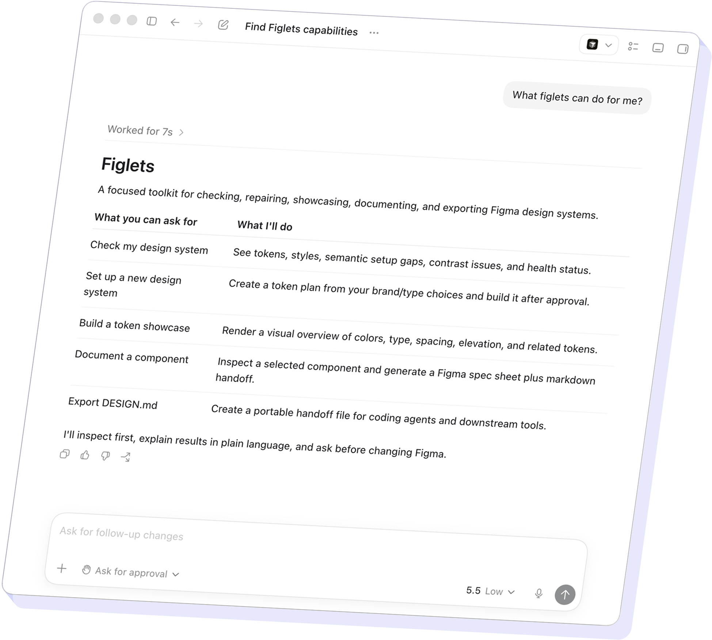
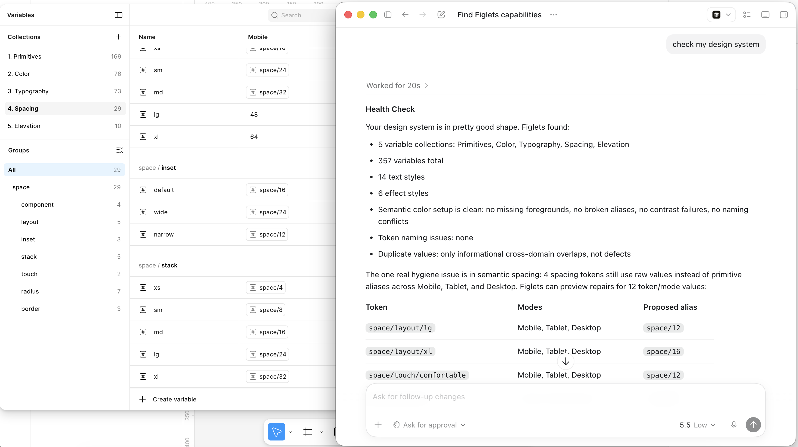
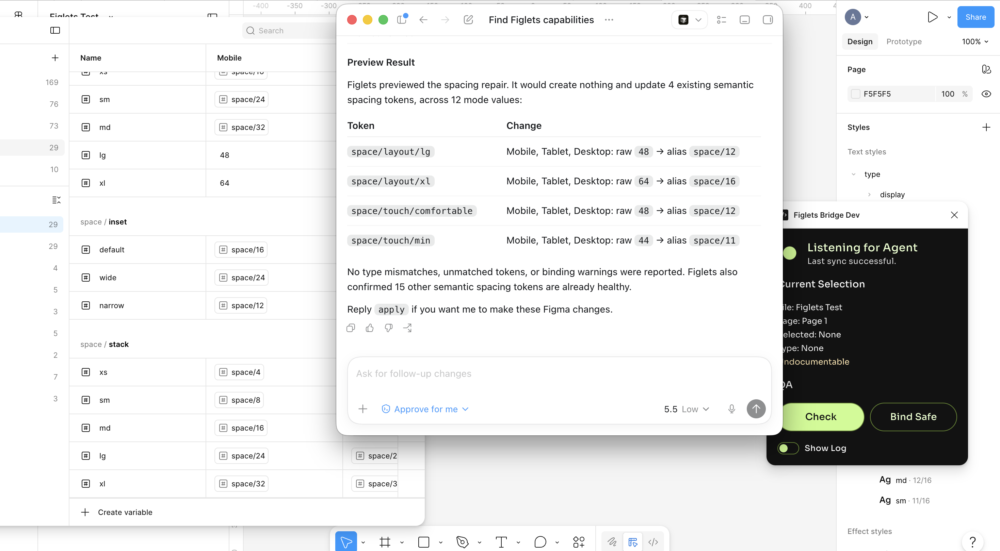
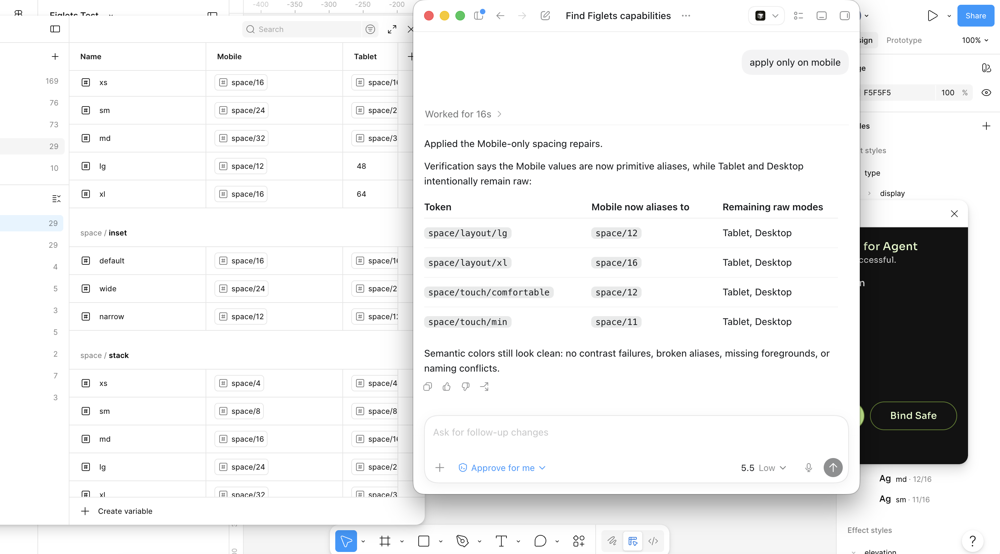

# Figlets MCP



A working, local-first AI interface for managing Figma design systems through plain language. Designers can audit systems, plan repairs, document components, and run repeatable QA while every Figma write stays explicit and approval-gated.


| AI hosts | Core workflows | Figma writes approval-gated |
|---:|---:|:---:|
| 6+ | 6 | 100% |

### My Role
Figlets is a personal project. I designed and developed it, from defining the product contract and core workflows to building the local tools and Figma bridge.

My main design responsibility was deciding what the AI could handle, what needed reliable code, and where the designer had to stay in control.

## Overview

Design systems rarely break all at once. They drift.

Token names become inconsistent. Contrast issues sit there quietly. Variables get duplicated. Teams keep shipping, but the system becomes harder to trust every sprint.

Figlets MCP is my attempt to solve that in a practical way.

The AI is the interface. Figlets is the engine. Designers can ask for what they need in plain language. Figlets runs the structured work locally, explains what it found, and asks before anything changes in Figma.

[Figlets MCP on GitHub](https://github.com/arashr/figlets-mcp)

## The Problem

I first built [Figlets as Claude-only skills](https://github.com/arashr/figlets). It worked, but the model was doing too much.

That made the output fragile. The agent could calculate contrast correctly, but it could also get it wrong. It could pick the right token alias, or invent one. It could explain a fix clearly, or jump ahead and make assumptions.

That was fine for a demo. It was not reliable enough for a real design system.

The product question was no longer “can AI help?” It was “where should the AI’s authority stop?”

## The Product Contract

I started the rebuild with one rule: AI should not own work that needed to be repeatable and verifiable.
That rule became the product contract:

**Code handles the reliable work.** Contrast math, alias selection, token-gap detection, repair planning, and validation.

**The agent handles the human layer.** Intent, explanation, missing context, repair choices, and approval.

**The Figma bridge handles the live file.** Approved changes go through Figma Desktop, not a hidden cloud process.

The architecture followed the product decision. The agent could guide the designer and adapt to their intent, but it could not freestyle over the file.

## AI as Interface

The bigger idea behind Figlets is AI as interface.

Traditional tools expect users to understand the structure of the software before they can use it. They need to know where to go, which setting matters, and what input the system expects.

With Figlets, the designer starts with intent. They can explain what they want in plain language, even if they do not know which workflow or tool is needed.

The agent translates that intent, asks for missing context, explains problems, and turns dead ends into next steps. But flexibility at the interface does not mean flexibility in execution. The work underneath still follows defined workflows and approval rules.

> I tell the agent what I want. It checks my Figma file, explains what it found, tells me what can be fixed, asks before changing anything, verifies the result, and suggests the next useful step.

The interface is flexible. The execution is controlled.



## Designing for Trust

The hardest design problem was trust.

Telling designers that the AI was “safe” would not be enough. Control had to be visible in the workflow:

```text
Sync → Inspect → Explain → Propose → Approve → Apply → Verify
```

Every write path starts read-only. Figlets checks the file and explains what it found before offering a repair. The designer sees the exact scope before anything changes, and Figlets checks the result afterward.

Trust is not a message shown before the workflow. It is how the workflow behaves.



## Approval Boundaries

Approval has to match intent.

If a designer approves fixing four Mobile spacing aliases, Figlets should not create Tablet and Desktop modes in the background. That may look helpful from the system side, but it breaks trust from the designer side. That led to an important rule: approval is not permission to “make things better.” It is permission to make the exact change the designer reviewed.

So repairs are grouped by scope. Foundation repairs, primitive updates, and semantic token writes each need separate approval.

After a repair is applied, Figlets syncs the file again, checks the result, and stops. It does not move into the next category unless the designer asks.



The repair menus use designer language too. “Fix the 4 spacing alias repairs” is better than exposing internal commands. It keeps the user focused on the decision, not the tool name.

## Knowing When Not to Decide

Some findings are real, but they should not be auto-fixed.

For example, `color/text/danger` and `color/text/on-danger` can look like duplicates. But they may represent different usage contexts. One could be normal danger text. The other could be text on a danger surface.

Figlets explains the conflict and asks the designer to choose the direction. It does not delete or rename variables just because they look similar.

Accessibility follows the same rule. If a suggested repair would fail contrast, Figlets does not show it as a one-click fix. The default path should not recommend bad accessibility decisions.

Stopping and asking is part of the product. It is not a failure of automation.

## Agent Interface

The first interface was scattered across prompts, adapter documentation, and tool descriptions.

Strong agents could fill in the gaps. Weaker agents could not. They dumped JSON, skipped steps, or wrote ad hoc scripts instead of following the intended workflow.

That changed how I understood the interface. It was not only the chat box. It was the full contract between the designer, the agent, and the local tools.

I turned that contract into an Agent Interface exposed through MCP:

- `figlets_start` introduces what Figlets can do.
- `figlets_route_intent` maps a plain request to the right workflow.
- `figlets_workflow_guide` gives step-by-step instructions with approval gates built in.

If the designer already states a goal, Figlets routes directly. If the request is unclear, it offers a structured choice instead of guessing.


## Core Workflows

**Check my design system**  
Audits tokens, checks semantic gaps, finds hygiene issues, ranks findings, and ends with a repair menu.

**Set up a new design system**  
Bootstraps variables and foundations from config. Intake questions come before token suggestions.

**Build a token showcase**  
Creates a visual reference frame in Figma for colors, typography, spacing, radius, and elevation.

**Document a component**  
Creates a handoff spec from the selected component with safer binding logic.

**Export DESIGN.md**  
Creates a portable design document for coding agents and cross-team handoff.

**Component QA and Audit**  
Audits selected layers for raw values and suggests safe bindings.

## From Skills to Product

The first version proved the idea, but it was still a collection of Claude-only skills. It depended on one AI host, and too much of the product behavior relied on the model interpreting instructions correctly.

Rebuilding it around MCP forced me to define stable tools, responsibilities, and boundaries:

- `figlets-core` handles analysis.
- `figlets-mcp-server` exposes stable tools.
- `figma-bridge-plugin` connects approved actions to the live Figma file.

The product decisions shaped the architecture.

Reports are written for conversation, not direct apply. Repair plans separate required, optional, and missing-capability items. Setup detects installed AI apps and writes MCP config, so designers do not need to edit JSON.

The Figma bridge uses a development import flow because localhost access is not allowed for Community-published plugins. It is not ideal, but it is honest. The product explains the tradeoff instead of hiding it.

## Iteration

I tested Figlets on real Figma files and weaker models on purpose. Strong models can hide bad product design. Weaker models expose it.

A few things changed through testing:

- Health checks now include token-gap findings in the first audit.
- Mobile-only spacing repairs no longer expand into wider foundation changes.
- Contextual roles like `on-fill-*` are no longer treated as simple duplicates.
- Component documentation now uses shared binding logic, so text layers do not bind to icon tokens.

More than one hundred automated tests now cover the workflows and their deterministic behavior. I still test approval behavior manually because passing a test is not the same as making a designer feel in control.

## Outcome

[Figlets MCP](https://github.com/arashr/figlets-mcp) is a working, public product.

It supports more than six AI hosts, includes six core workflows, and has more than one hundred automated tests. Every Figma write is approval-gated.

Designers can audit a system, plan and approve repairs, build token showcases, document components, run binding QA, and export DESIGN.md through natural language.

My main design contribution was not a single screen or feature. It was the product contract: how the system frames findings, where the AI’s authority stops, how approval stays narrow, and how every applied change is verified.

Figlets started as “AI might help with design-system work.” It became a structured assistant that can explain, guide, and act without taking control away from the designer.