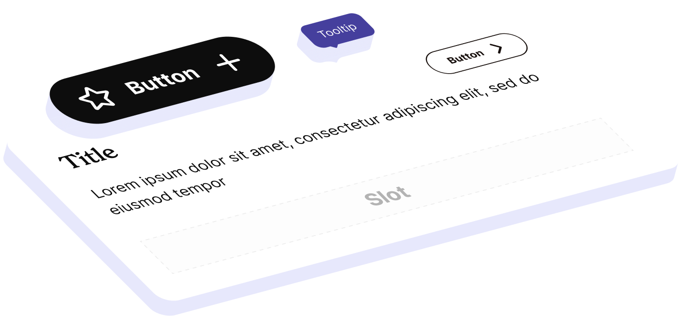
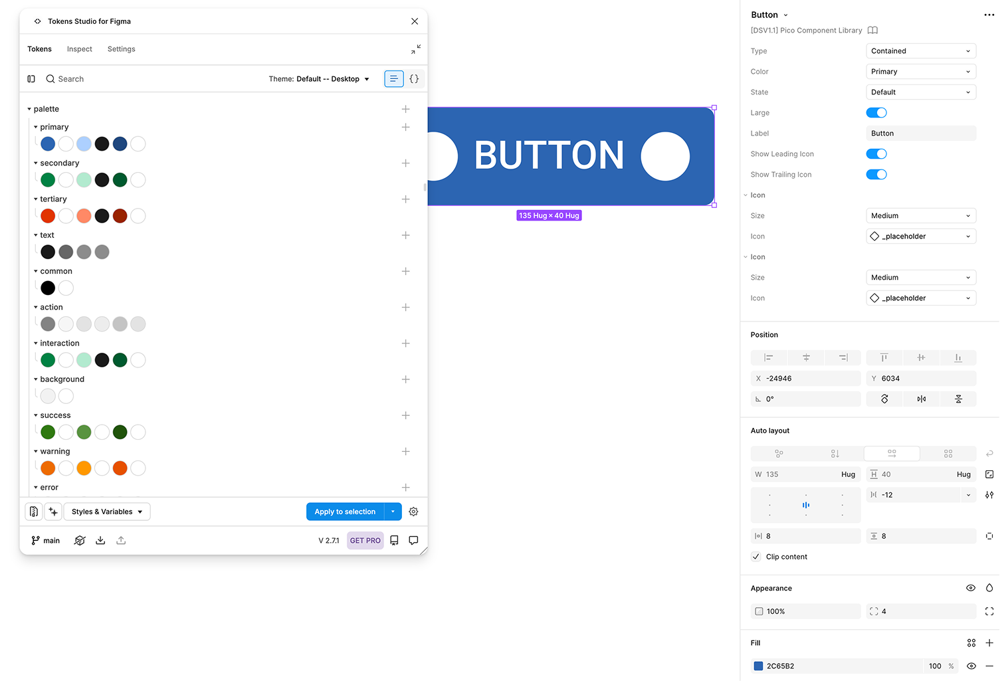
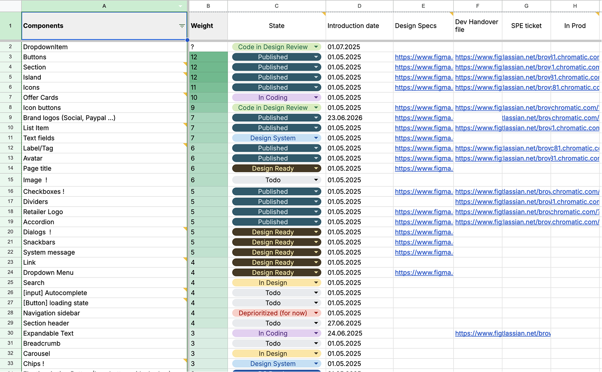
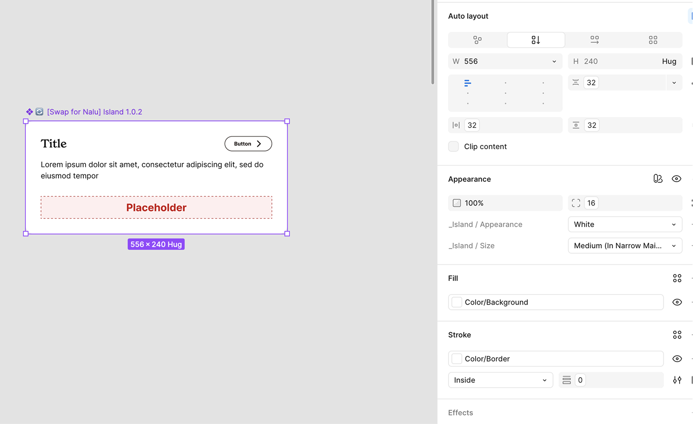
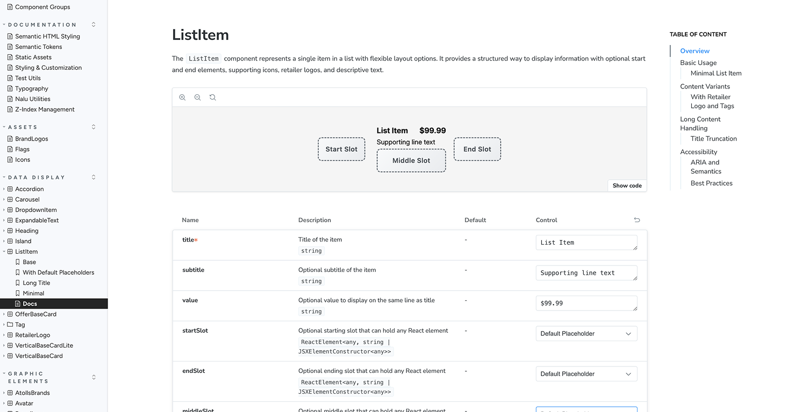

# Atolls Design System


<br>
We had less than two months to rebuild a design system that had become a blocker. It needed to support a new brand, work across four products, stay in sync with code, and make future brand changes much easier. I led the product design work, from deciding what had to ship to defining the foundations, token architecture, components, and documentation.
<br>

| Faster feature development | Products supported | Adoption |
|---:|---:|---:|
| +50% | 4 | 75% |

## Overview

We already had a design system, but it had stopped helping us move.

Components were hard to adapt. Token changes took too long to reach code. Applying a theme in Figma was painfully slow. Our products were starting to bend around the system instead of the system supporting the products.

The new brand identity did not create the problem. It exposed it.

## The Breaking Point

On paper, the ask was simple: update the products to match the new brand. Rounded buttons in a distinct color. Easy, right?

Wrong.

The buttons in our design system were locked to the brand’s primary color. They literally refused another color. And that was just one example.



The system was based on TokensStudio tokens, which didn’t play nicely with Figma variables. Adding tokens? Nightmare. Any change? Took weeks to reach the code. Applying a theme in Figma? Go make a coffee, or three.

The new brand wasn’t just a visual refresh. It forced us to admit the system was done.

## The Challenge

I led the product design work, but I did not do it alone. I worked with another product designer, a design engineer, and engineers responsible for connecting the system to code.

My part covered prioritization, defining the minimum viable system, building the early proof of concept, and shaping the foundations, semantic tokens, components, states, and documentation.

The wishlist was ambitious:

- Mobile-friendly
- Accessible
- Scalable
- Fast-growing and reliable
- Easy to use
- In sync with code

The deadline was less than two months. So “build everything” was never an option. We had to decide what the products genuinely needed and what could wait.

## Prioritization

We started with a workshop. All product designers in the room, figuring out: what do we actually need in two months, and what can wait?

Example: no date pickers. We don’t even use them in our products.



The first decision was what not to build.

I ran a workshop with the product designers to map what our products actually used, which patterns repeated, and what could wait. Date pickers stayed out because none of our products needed them. Building one just to make the library look complete would have wasted time we did not have.

We prioritized the foundations and components that were already appearing across the products: color, typography, grids, dimensions, icons, and the most common interaction patterns.

In parallel, the design engineer and engineers explored how Figma variables would connect to code, and where AI and MCP could make the workflow faster.

That gave us a realistic first release instead of an impressive-looking wishlist.

## Proof of Concept

During the workshop, I built a deliberately scrappy version of the new system. It used basic elements in the new brand, with every property connected to a variable.

The point was not to make it polished. It was to test the direction immediately and give designers something they could use while the real system was still taking shape.



Initial component drafts were ready within a day or so. That let product designers test the new visual direction while the brand team adjusted the identity for product use and engineering worked on the connection to code.

Instead of waiting for each track to finish, the proof of concept let all of them move together.

## Iteration

Once the direction held up, I moved into the foundations underneath it: color ramps, typography scales, grids, dimensions, accessibility, and the variable structure.

The biggest architectural decision was separating raw values from brand choices and component meaning:

```text
Primaries → Brand Layer → Semantics → Patterns
```

This meant a brand could change at the brand layer without every component needing to be rebuilt. It also kept the number of variables manageable as the system grew.

With the structure in place, we built the components and gave important patterns their own tokens. States, behavior, and implementation expectations were documented for handoff instead of being left inside the Figma file.

The system was not only a new set of components. It was a shared model for how design decisions should move from brand to product to code.

## Delivery

We delivered the first version in under two months.

The system supported four products and reached 75% adoption at the point documented. Components could support different appearances, emphasis levels, sizes, and brands without being rebuilt for every use.



Everything lived in one central, documented library. We also set up clear channels for feedback and updates because shipping the library was only the beginning. The system needed a way to keep growing without becoming another outdated file.

Updates that previously took weeks could now roll out in as little as one week. With the shared library, documentation, and AI and MCP workflow, developers were able to build features more than 50% faster.

## Lessons Learned

The biggest lesson was that rebuilding the components was only part of the job.

We also had to decide what not to build, give designers something useful before the final system was ready, connect design decisions to code, and create a way for the system to keep changing after launch.

The early proof of concept kept the products moving. The layered token structure made brand changes possible without rebuilding every component. The feedback workflow gave the system somewhere to grow.

The old system had become a blocker because the products had outgrown it. The new one gave them room to keep moving.
