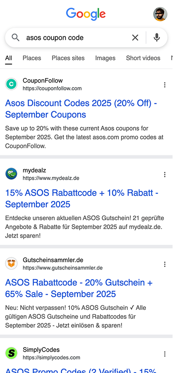
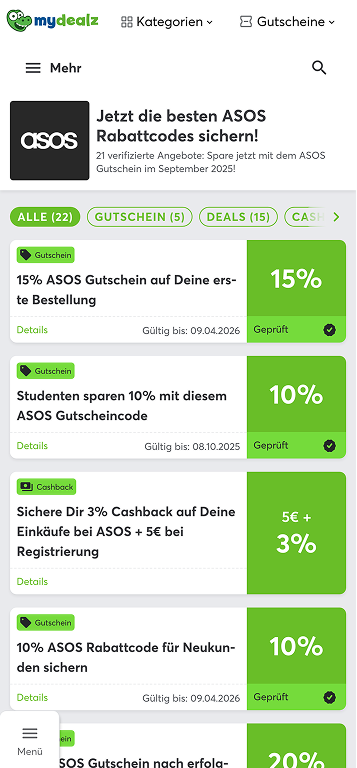
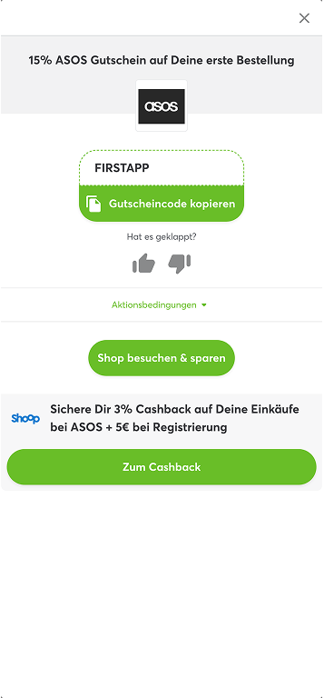
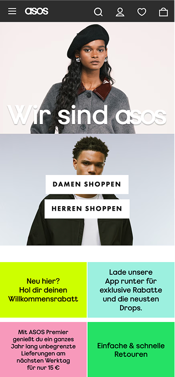
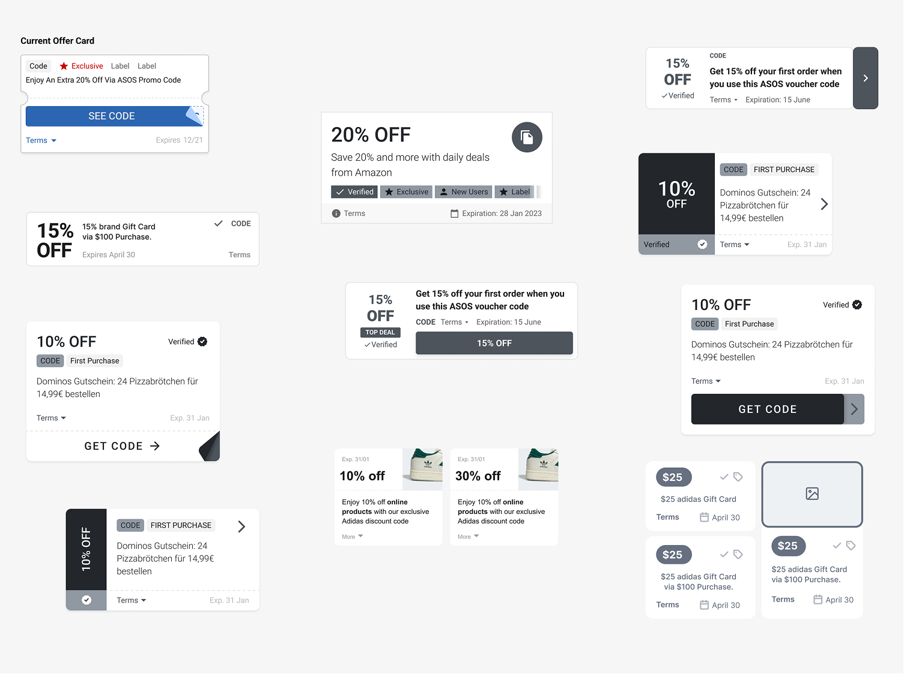
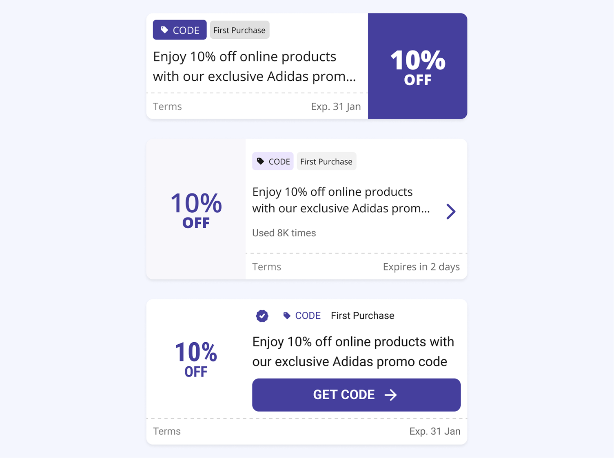
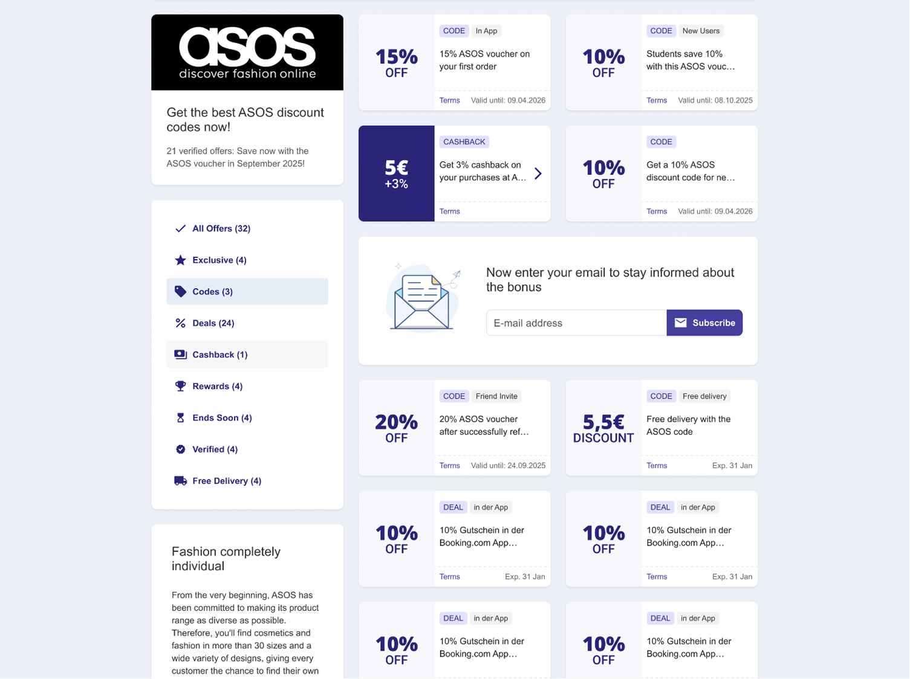
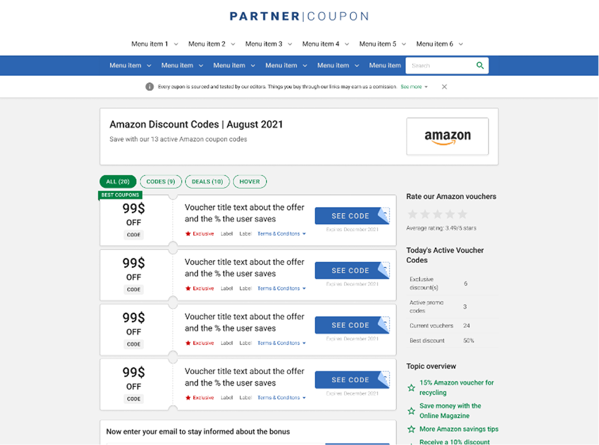
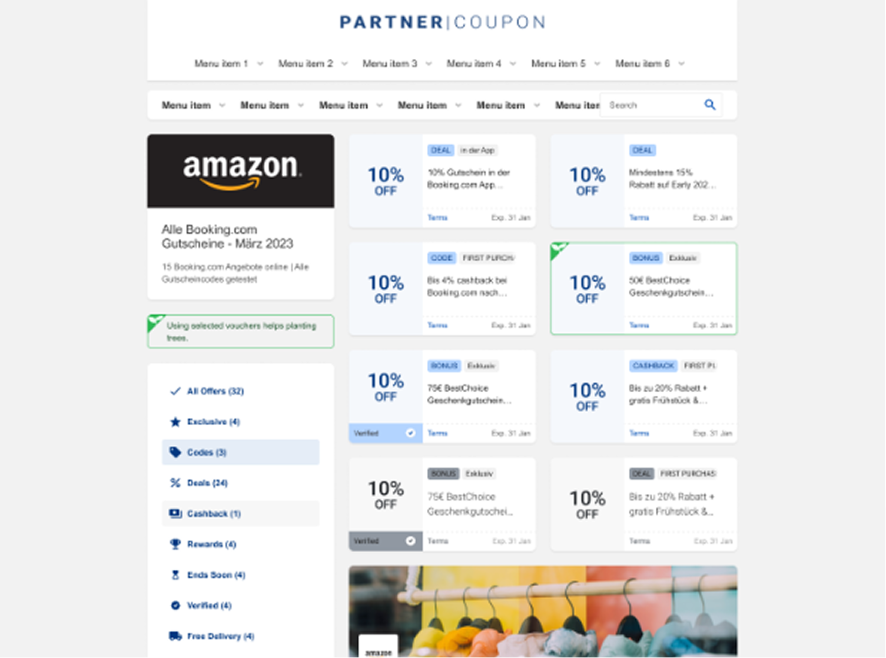
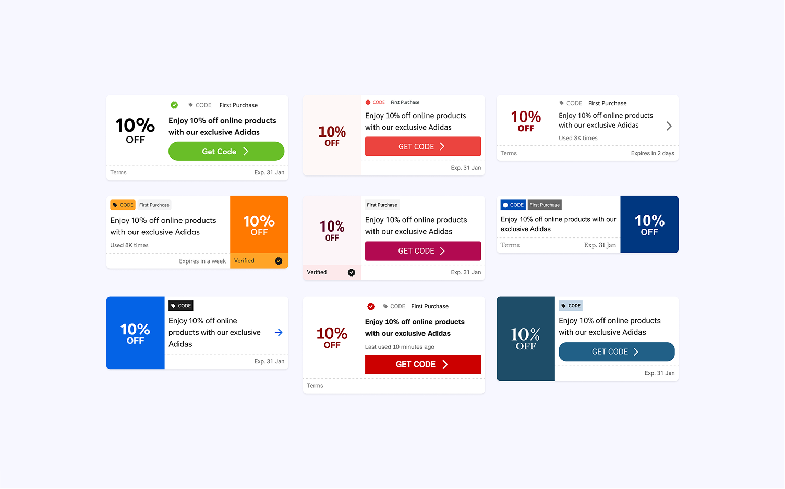

# Atolls Conversion Growth

At Atolls, formerly Global Savings Group, we built a white-label coupon and deal platform used by more than 50 publisher brands.

Each page lived inside a publisher’s domain and had to feel like part of that publication, even though the underlying product was shared.

For users, the value was simple: find a useful discount. For the business, everything depended on whether they clicked the offer and continued to the retailer.

 

| CTR uplift | Sessions tested | Publisher brands on platform |
|---:|---:|---:|
| 8% | +364K | 50+ |

### My Role
I led the product design work from early exploration through large-scale testing. I helped challenge the assumptions behind the existing design, shaped the three main variants, ran preference tests and user interviews, analyzed regional differences, and designed the flexible card structure used for publisher and market adaptations.

## The Business Model

- **GSG:** Provided the platform and technology
- **Publishers:** Supplied the audience and trust
- **Retailers:** Offered the deals
- **Users:** Found discounts and saved money

The model depended on a short chain of trust: users trusted the publisher, found a useful offer, and clicked through to the retailer. If that click did not happen, the page did not generate revenue.

## The User Journey

Picture this:

A user wants new shoes, Googles for a coupon, lands on our publisher-branded page, grabs a deal, clicks through, and, if the voucher works, never looks back.

Our only shot at revenue was that single click on the offer.

A razor-thin window for conversion.

| Google Search | Conversion Point | Post Click-out | Retailer |
|---|---|---|---|
|  |  |  |  |

## The Challenge

I led the product design work for a full visual overhaul.

The design needed to do three things at once:
- Feel more modern and easier to scan
- Still belong inside each publisher’s brand
- Protect the click-through behavior that generated revenue

Those goals did not always point in the same direction. A cleaner design could show fewer offers. A stronger publisher identity could reduce consistency across the platform. A more minimal card could remove the CTA users were already familiar with.

Even a small conversion drop would have had a real revenue impact, so visual preference alone was never going to be enough.

## How We Tackled It

We started wide on purpose. In the first workshop, we explored what the offer experience could look like without treating the existing card as the answer.

We could not ignore the practical constraints for long. Every card still needed to communicate:
- Offer value
- Description, largely for SEO
- Terms of use
- Expiration date

Research gave us a clearer hierarchy. Users cared most about the value of the offer and the terms that could make it useless to them, such as “new users only.”

The more interesting questions came from the assumptions built into the old experience:
- Did showing more deals above the fold really improve conversion?
- Did an offer need a traditional CTA button to feel clickable?

We treated those as questions to test, not rules to design around. Some of our concepts removed the CTA entirely and relied on offer prominence, layout, hover feedback, and lighter interaction cues instead.

## Design Iterations and User Testing

We narrowed the exploration down to three main directions. Each one tested how much interaction guidance the card really needed.

### 1. Value-forward card

A large, right-aligned offer value with no button. This pushed the value itself to do most of the work.

### 2. Arrow cue

A left-aligned offer value with an arrow as a lighter signal that the full card was clickable.

### 3. Classic CTA

A traditional call-to-action button that kept the interaction pattern users already knew.

For the buttonless directions, we added hover feedback to make the full card feel interactive. We also tested a grid layout that could fit more offers above the fold without returning to the old visual density.

Tags such as “App Only” and “Students” brought important restrictions forward instead of hiding them inside the description.

Preference tests and user interviews helped us narrow the directions and catch comprehension issues. We then put the finalists into a large-scale A/B test to see what people actually did.

## What We Learned

Across more than 364,000 sessions, every new variant outperformed the old design on conversion.

The strongest overall result came from the grid layout with the arrow cue:
- 8% CTR uplift on the primary metric
- 10% E2V uplift on our internal order-value metric

But the most useful finding was that there was no universal winner for every market.
Buttonless designs performed better in most markets, while Germany still responded better to a traditional CTA. Upfront tags made important terms easier to scan, and the grid increased filter interactions, suggesting that showing more options also created a greater need for narrowing them.

The result was not simply “remove the button.” It was a better understanding of when different interaction cues worked.

| Before | After |
|---:|---:|
|  |  |

## Iteration and Personalization

The overall winner did not need to become a rigid rule.

We designed the card structure so the interaction cue, layout, and visual treatment could be adapted for different publishers and markets. That meant we could preserve a traditional CTA where the evidence supported it, while using the lighter arrow treatment elsewhere.

The same structure also gave each publisher room to feel like itself without requiring a separate product design.

## Looking Back

If I did this again, I would test smaller changes earlier.

Our final variants combined several decisions: hierarchy, interaction cues, tags, and layout. The test told us which overall direction performed best, but it could not fully isolate how much each individual change contributed.

We still reached the goal and improved conversion, but a more granular testing plan would have given us clearer evidence about why.

Next time, I would build shorter feedback loops into the project from the beginning, then use the larger redesign test to confirm the complete experience.