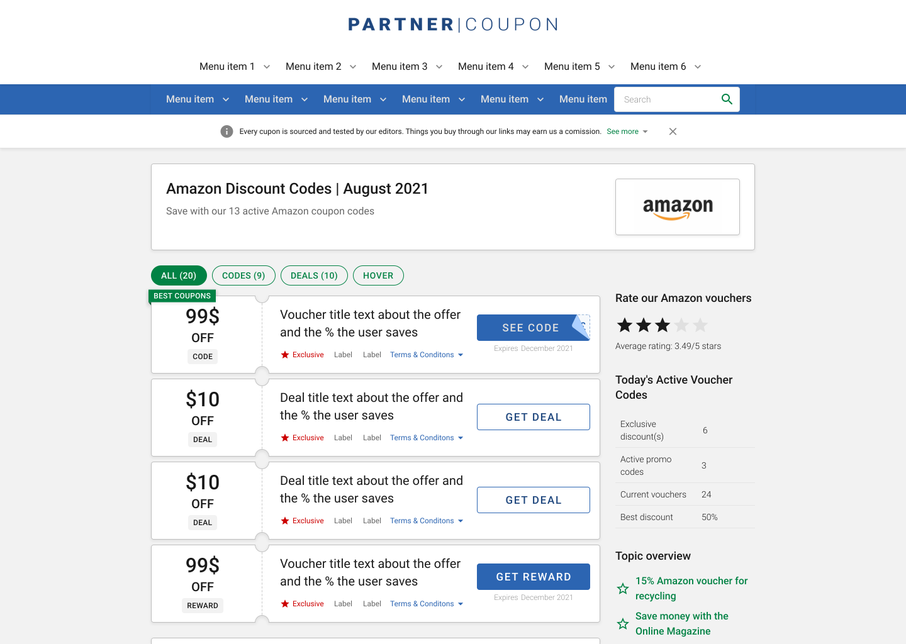
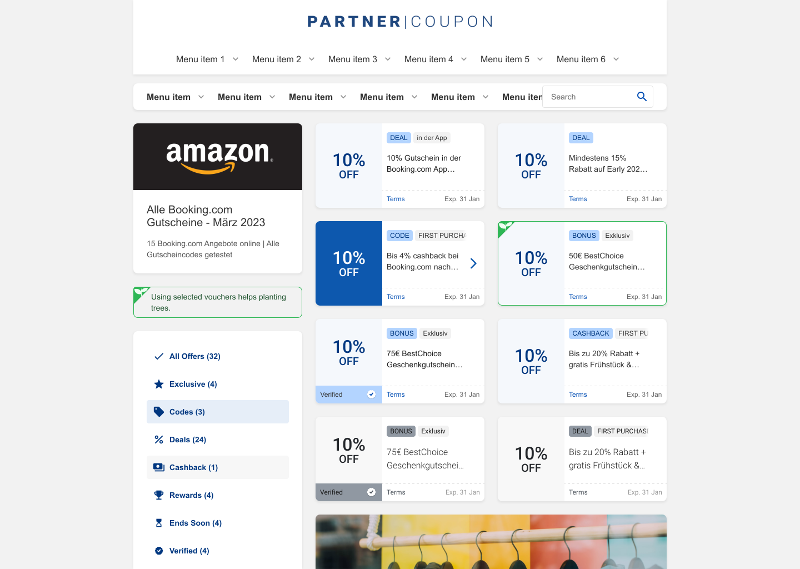

# Atolls Conversion Growth

At Atolls, formerly Global Savings Group, we built a white-label coupon and deal platform used by more than 50 publisher brands.

Each page lived inside a publisher’s domain and had to feel like part of that publication, even though the underlying product was shared.

For users, the value was simple: find a useful discount. For the business, everything depended on whether they clicked the offer and continued to the retailer.

 

| CTR uplift | Sessions tested | Publisher brands on platform |
|---:|---:|---:|
| 8% | +364K | 50+ |

### My Role
I led the product design work from early exploration through large-scale testing. I helped challenge the assumptions behind the existing design, shaped the three main variants, ran preference tests and user interviews, analyzed regional differences, and designed the flexible card structure used for publisher and market adaptations.

## The Business Model

- **GSG:** Provided the platform and technology
- **Publishers:** Supplied the audience and trust
- **Retailers:** Offered the deals
- **Users:** Found discounts and saved money

The model depended on a short chain of trust: users trusted the publisher, found a useful offer, and clicked through to the retailer. If that click did not happen, the page did not generate revenue.

## The User Journey

Picture this:

A user wants new shoes, Googles for a coupon, lands on our publisher-branded page, grabs a deal, clicks through, and, if the voucher works, never looks back.

Our only shot at revenue was that single click on the offer.

A razor-thin window for conversion.

| Google Search | Conversion Point | Post Click-out | Retailer |
|---|---|---|---|
|  |  |  |  |

## The Challenge

Senior leadership asked Product Design to modernize an experience that was looking outdated against competitors. I already owned this revenue-critical flow and had evidence from recent conversion experiments, so I proposed using the overhaul to improve the user experience and test long-standing assumptions rather than treating it as a visual reskin.

Protecting conversion was already part of the brief because this was the company’s main revenue-generating flow. Given the scale and risk, limited-sample preference testing was not strong enough evidence for senior leadership. After we challenged the assumptions in workshops, the Director of Design and other stakeholders approved moving the hypotheses into large-scale behavioral testing.

The design needed to do three things at once:
- Feel more modern and easier to scan
- Still belong inside each publisher’s brand
- Protect the click-through behavior that generated revenue

Those goals did not always point in the same direction. A cleaner design could show fewer offers. A stronger publisher identity could reduce consistency across the platform. A more minimal card could remove the CTA users were already familiar with.

Even a small conversion drop would have had a real revenue impact, so visual preference alone was never going to be enough.

The project involved more than Design and Engineering. Product worked directly with us, while Data provided evidence about the existing flow. SEO needed to protect Google ranking because organic search generated most of the revenue, and other business stakeholders reviewed early prototypes before implementation. Testing competing directions instead of committing to an unproven redesign reduced concern, while the eventual results provided the evidence for the final direction. Product and tribe leadership approved the risk of testing changes to this revenue-critical flow.

## How We Tackled It

We started wide on purpose. In the first workshop, we explored what the offer experience could look like without treating the existing card as the answer.

We could not ignore the practical constraints for long. Every card still needed to communicate:
- Offer value
- Description, largely for SEO
- Terms of use
- Expiration date

Research gave us a clearer hierarchy. Users cared most about the value of the offer and the terms that could make it useless to them, such as “new users only.”

Two assumptions had repeatedly surfaced in Product and senior Design discussions: that showing more deals above the fold improved conversion, and that every offer needed a traditional CTA. Blue-sky exploration and internal and external preference tests gave us enough evidence to test alternatives. Competitor analysis and mobile interaction research also suggested that a card could communicate clickability without a button.

These ideas still had to accommodate business constraints. The CTA was repeatedly requested during exploration, so we retained it as one experimental variant rather than accepting it as an untested rule. SEO required descriptions even though our initial interviews did not show that users found them useful. Terms and conditions were legally required in some regions, so the card needed to support them as an optional element.

We also explored larger, less dense cards and different arrangements. Concern about reducing the number of offers above the fold kept some of those directions out of the finalists.

## Design Iterations and User Testing

After internal design critiques and discussions with Product and other stakeholders, I selected the three finalists with the Director of Design and senior product managers. We prioritized directions with the strongest qualitative signal, manageable implementation effort, and sufficient compatibility with the existing design system. Each one tested how much interaction guidance the card really needed.

### 1. Value-forward card

A large, right-aligned offer value with no button. This pushed the value itself to do most of the work.

### 2. Arrow cue

A left-aligned offer value with an arrow as a lighter signal that the full card was clickable.

### 3. Classic CTA

A traditional call-to-action button that kept the interaction pattern users already knew.

Preference tests favored prominent offer values, recognizable labels for qualifying terms, and sometimes less busy layouts. The findings were directional rather than definitive, but they helped us select the finalists. Interviews showed that users struggled to find deal values, scan the cards, and identify relevant terms and conditions.

We removed concepts with weak value prominence or unclear information hierarchy before the A/B test. I shaped which information stayed on the cards, brought qualifying terms such as “App Only” and “Students” into the first scan, and refined the hierarchy. I also considered design-system compatibility and used my front-end knowledge to assess implementation effort.

For the buttonless directions, we added hover feedback to make the full card feel interactive. We also tested a grid that could fit more offers above the fold without returning to the old visual density.

I designed the A/B test with my product manager. I helped select the variants, testing method, device segmentation, and metric approach. Business had already defined CTR as the gate metric, while the Product team selected E2V after discussions with me. E2V acted as a guardrail to check that additional clicks also produced value reflected in basket size. The product manager selected the markets and publishers, while I contributed to the device segmentation.

## What We Learned

Across more than 364,000 sessions, every new variant outperformed the old design on conversion.

The strongest overall result came from the grid layout with the arrow cue:
- 8% CTR uplift on the primary metric
- 10% E2V uplift on the guardrail metric

But the most useful finding was that there was no universal winner for every market.
Buttonless designs performed better in most markets, while Germany still responded better to a traditional CTA. Upfront tags made important terms easier to scan, and the grid increased filter interactions, suggesting that showing more options also created a greater need for narrowing them.

The result was not simply “remove the button.” It was a better understanding of when different interaction cues worked.

| Before | After |
|---:|---:|
|  |  |

## Iteration and Personalization

The overall winner did not become a universal rule. I raised market-specific treatment with Product and discussed its technical feasibility with Engineering because this could not be a design-only decision. The Product team agreed to preserve the traditional CTA in Germany, where the evidence supported it.

The results also changed the rollout plan. We adopted regional and gradual rollouts in untested markets rather than assuming the overall winner would work everywhere. The flexible card structure became the starting point for a broader design architecture and a baseline for more detailed experiments.

Publishers did not participate directly in the design decisions. Before this project, the same card design was used across publishers and markets. The configurable architecture introduced the ability to adapt treatments for different contexts while preserving a shared structure.

It also solved a separate product problem. Different use cases had previously required separately designed and implemented cards. They could now use the same parent card with different configurations, reducing repeated design and engineering work. Other feature teams later adopted this architecture across additional flows and pages.

## Looking Back

If I did this again, I would test smaller changes earlier.

Our final variants combined several decisions: hierarchy, interaction cues, tags, and layout. The test told us which overall direction performed best, but it could not fully isolate how much each individual change contributed.

We still reached the goal and improved conversion, but a more granular testing plan would have given us clearer evidence about why.

Next time, I would build shorter feedback loops into the project from the beginning, then use the larger redesign test to confirm the complete experience.