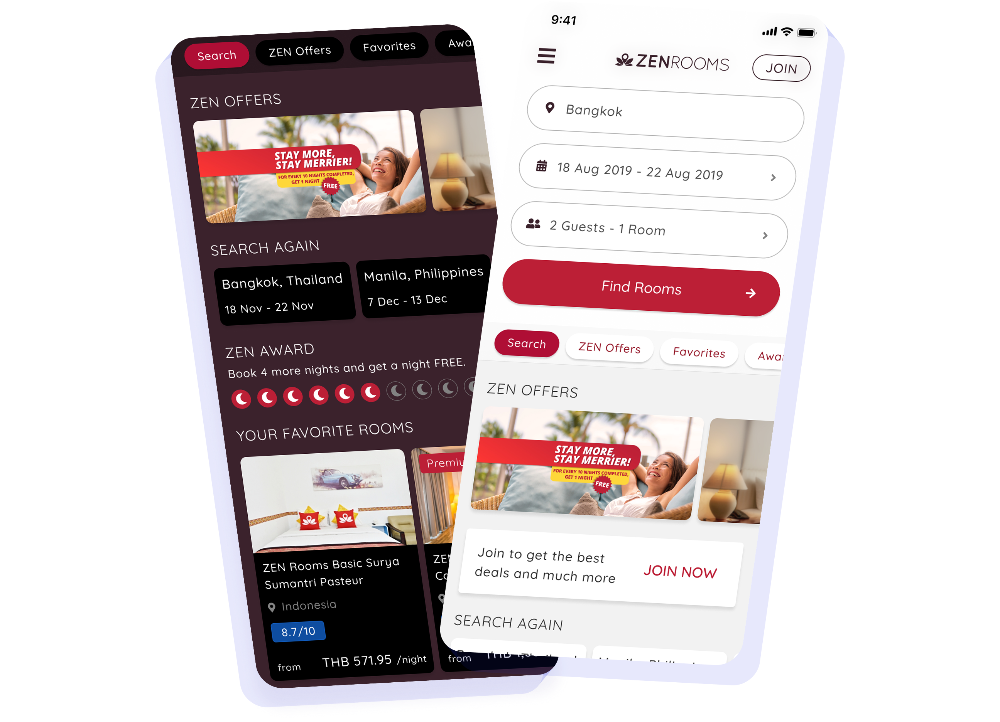
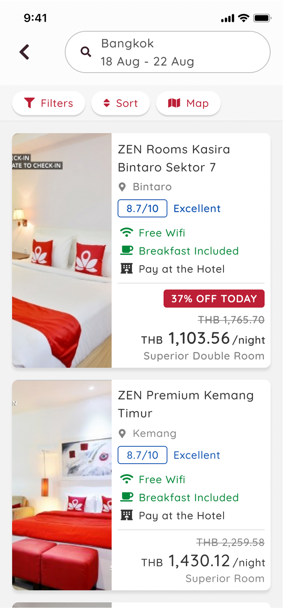
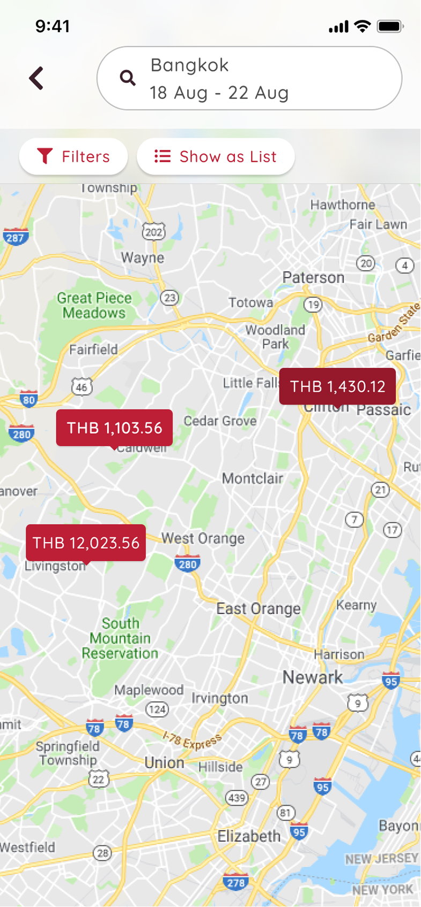
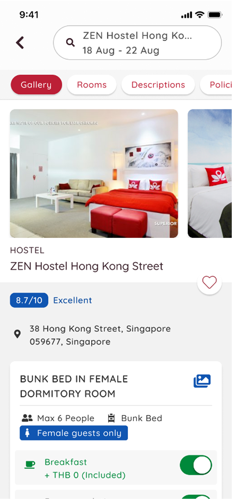
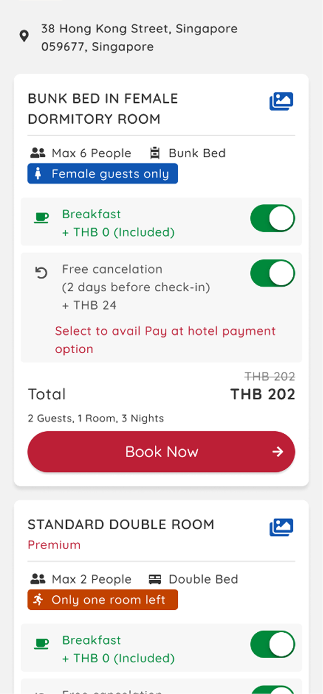
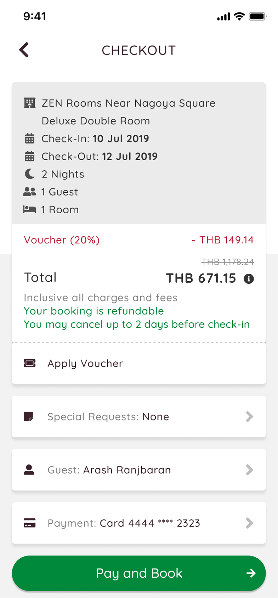
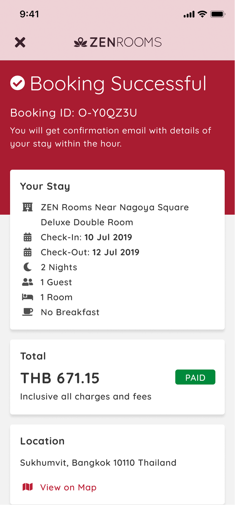

# ZENRooms Native App

ZENRooms had a mobile app, but it was the mobile website running inside a web-view wrapper.

I spent one month designing what the product could become as a proper native app for iOS and Android.

| Native app design | Design timeline | Mobile platforms |
|---:|---:|---:|
| 0→1 | 1 month | iOS, Android |

ZENRooms was a budget and mid-range hospitality company operating across Southeast Asia. It has since shut down operations.

## My Role

I was the solo product designer, working with the Product Manager and engineers who had React Native experience.

I covered the complete experience:

- Search and discovery
- Map results
- Hotel details
- Room selection
- Accounts
- Checkout
- Booking confirmation

I involved engineers from the early wireframes through the functional prototype. We discussed feasibility and practical implementation constraints while the design was still flexible.

The complete design was tested and handed off as the initial phase of the native product.

## The Problem with the Wrapper

The existing app was a mobile website inside a native shell.

Users could see and feel the limitations:

- Pages had visible loading delays
- Login did not persist properly
- Search history and preferences were not retained
- Guest and payment information had to be entered again
- The experience did not behave like a real mobile app

The wrapper gave users little reason to open the app instead of using the website.

The opportunity was not simply to redraw the same screens. It was to reconsider the experience around what a native product could remember and do.

## Starting with Existing Evidence

The native app did not start from scratch.

It followed the earlier ZENRooms website redesign and conversion experiments. That work had already shown us where users struggled with discovery, navigation, information hierarchy, touch interactions, error recovery, and checkout.

I carried those findings into the native app instead of reopening every decision.

This gave me an educated starting point:

- Make hotel discovery easier to scan
- Keep room selection prominent
- Reduce checkout steps and repeated input
- Prevent users from getting trapped after an error
- Design for touch from the beginning
- Keep the journey consistent from search to confirmation

The web experiments gave me evidence about the booking journey. The native prototype helped me test how those decisions worked in a mobile product with persistent login, saved information, and native behavior.

## Design Principles

I used two principles to guide the work.

### Keep It Familiar

ZENRooms already had an existing customer base and visual identity. The app still needed to feel like the same service.

I kept the established design language while reorganizing the experience around mobile use.

### Use the Platform Properly

The app should not feel like a smaller website.

That meant designing for touch from the beginning, using familiar mobile behavior, preserving state, and removing the obvious loading experience of the web wrapper.

The intended implementation used React Native. iOS and Android followed the same core product structure and interaction model rather than becoming two separate product designs.

## Designing the Complete Journey

The one-month timeline was for design.

The goal was not to create a limited visual refresh. It was to reimagine the complete booking experience and explore capabilities the wrapper could not support.

The scope covered the full journey:

`Search → Results → Hotel details → Room selection → Checkout → Confirmation`

It also included accounts, saved information, search history, preferences, and map-based discovery.

| Search results | Results on map | Hotel details |
|---:|---:|---:|
|  |  |  |

## Discovery That Felt Native

The discovery experience was designed around quick scanning and touch.

Users could move between a hotel list and map results, understand where properties were located, and continue into hotel details through one connected flow.

The design preserved the information users already needed while making the path through search, comparison, and room selection easier to follow.

This was one of the areas I adjusted after testing. Some elements needed stronger visual hierarchy and clearer navigation to make the results easier to scan.

## Giving Accounts a Purpose

The old wrapper did not make a logged-in state particularly useful.

A native product created a reason to have an account:

- Persistent login
- Saved search history
- Stored preferences
- Remembered guest information
- Saved payment information
- A more personal experience for returning guests

The app could remember enough context to make the next booking easier.

For returning users, that was the main advantage. The product did not need to ask the same questions every time.

## Reducing Checkout Work

Checkout was the most important flow to simplify.

In the existing experience, users had to enter guest and payment information again when making another booking.

The native design supported securely saved guest and payment information that could be recalled for later use.

Two of the three checkout stages could arrive prefilled:

- Guest information
- Payment information

Users could review or change the details when needed instead of starting with an empty form.

This reduced repeated input while keeping the information editable and under the user’s control.

| Room options | Checkout | Booking confirmation |
|---:|---:|---:|
|  |  |  |

Less typing. Fewer repeated decisions. A shorter path from choosing a room to confirming the booking.

## Testing on a Real Device

I built a functional Figma prototype and tested it on a mobile device through guerrilla testing at a coworking space.

The participants worked at other companies and were not part of the ZENRooms team.

I tested whether they could:

- Understand the main tasks
- Discover and compare hotels
- Navigate between the list, map, and hotel details
- Select a room
- Move through checkout
- Reach a completed booking state

The core journey worked without major structural problems.

Testing led to smaller adjustments in two areas:

- Improving how quickly users could scan important elements
- Clarifying navigation during the discovery flow

This was lightweight guerrilla testing, not a formal usability study. It was a practical way to test the complete journey on a real device before treating the design as finished.

## Working with Engineering Early

I involved the React Native engineers while the work was still at the wireframe stage.

We reviewed the flows and later prototypes together to discuss whether the interactions were feasible and practical within the intended shared implementation.

This kept the design grounded. The prototype explored what a native experience could offer, but it was not created in isolation from the people who would need to build it.

## Design Outcome

The complete native app design was finished in one month and handed off as the initial phase of the native product.

The work covered the full booking journey for iOS and Android, including discovery, map results, hotel details, accounts, room selection, checkout, and booking confirmation.

The functional prototype was:

- Tested on a real device
- Refined through guerrilla testing
- Reviewed with React Native engineers
- Designed around persistent state and saved information
- Informed by findings from the earlier web conversion experiments
- Handed off as a complete native product direction

[See Prototype](https://www.figma.com/proto/FiUnKMcDthBbkRniiRosEL/ZEN-App "See ZENRooms App Prototype")

The outcome was a complete view of what the ZENRooms app could become when it stopped behaving like a website inside a shell.