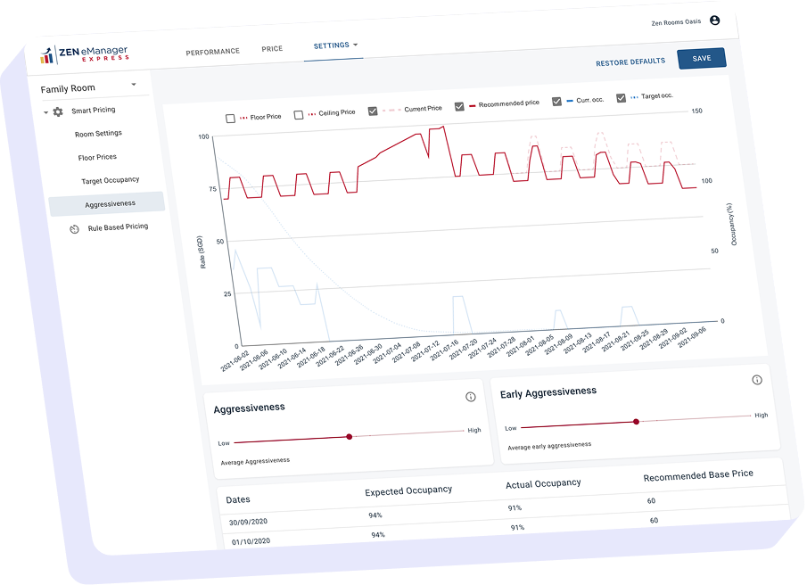
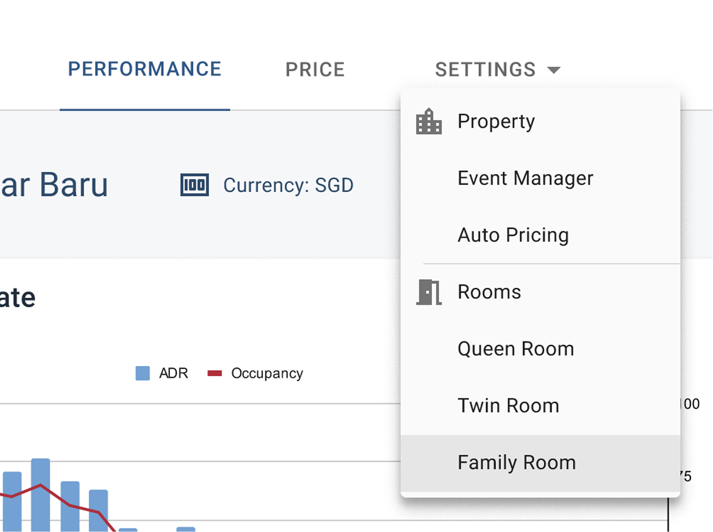
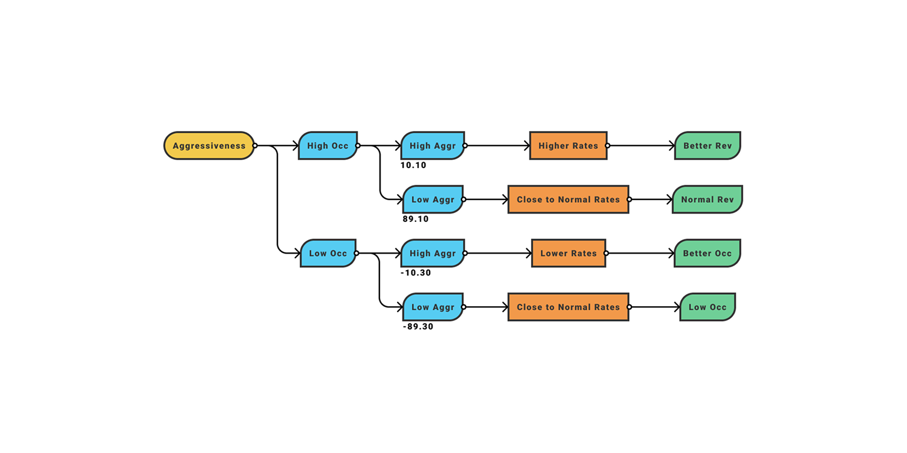
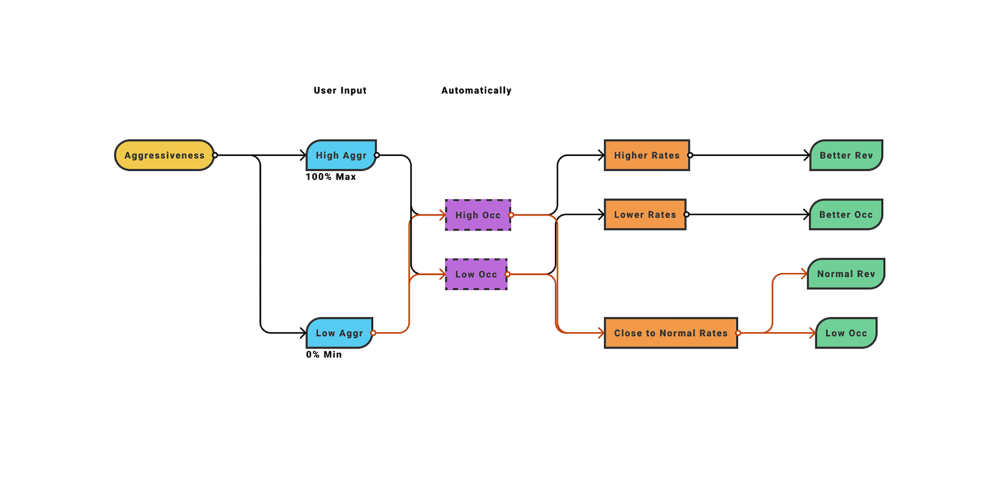
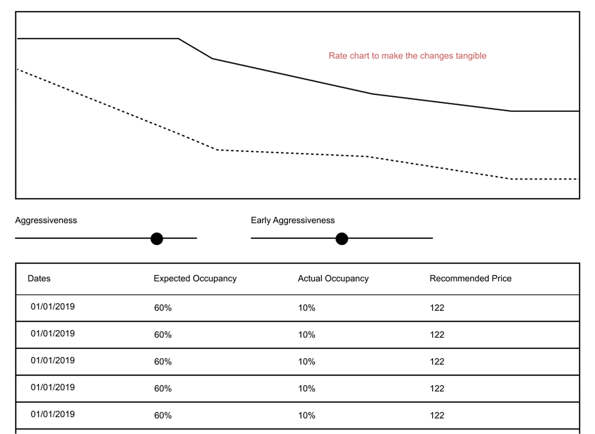
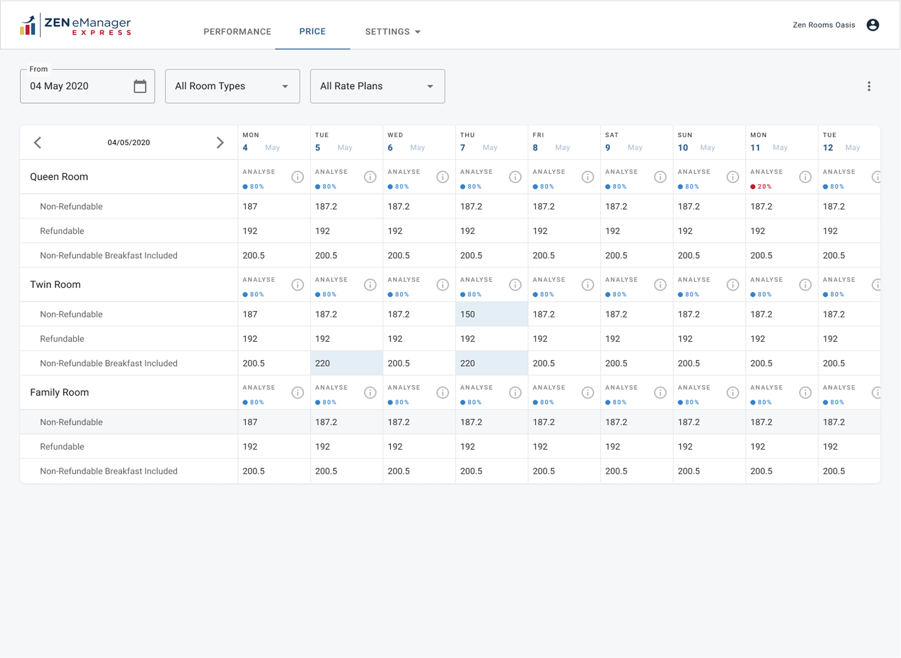
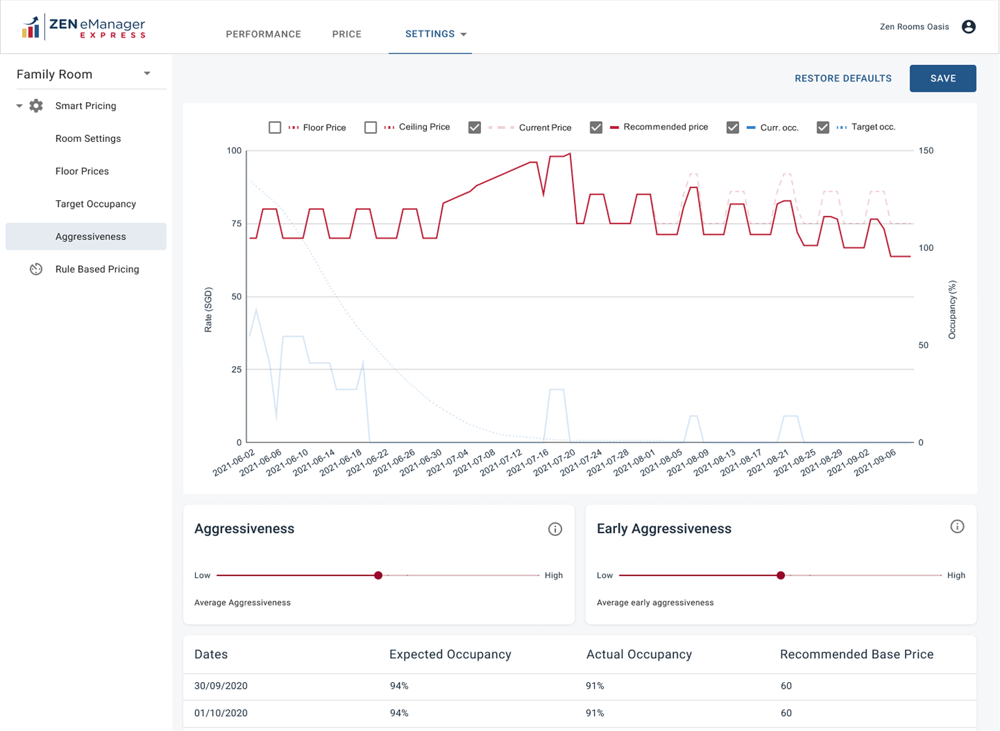
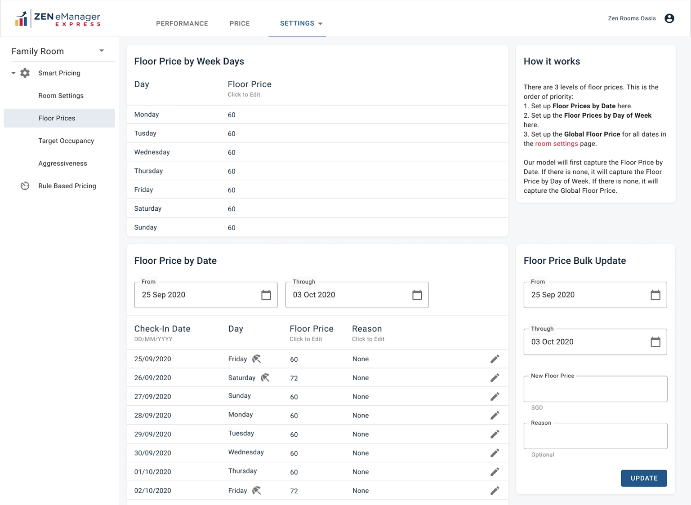
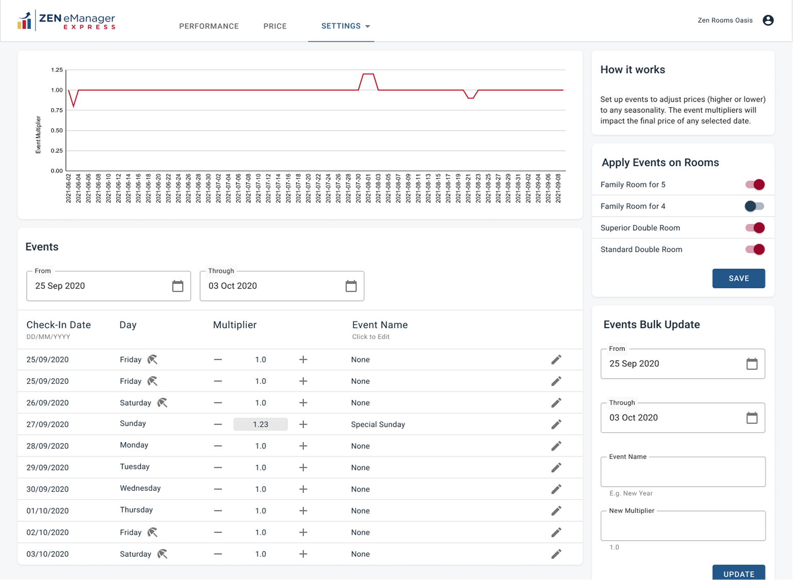

# Hotel Revenue Management System

ZEN Rooms had developed a pricing algorithm to help hotels manage occupancy and revenue.

It worked, but only our internal specialists could use it. My job was to turn that internal system into a product that hotel operators could understand and control themselves.

| New B2B product | MVP delivery | Initial hotels |
|---:|---:|---:|
| 0→1 | 3 months | 100+ |

## My Role

I led the product work from understanding the existing system through planning, design, validation, and MVP delivery.

I worked directly with engineers to understand the algorithm and existing logic. I also worked with sales, company leadership, and the internal admins who used the old back-office tool every day.

My responsibility was to turn a complicated set of inputs and calculations into something a hotelier could use without needing to understand the math behind it.

## The Business Problem

The company was expanding its B2B offering, and this product was a high priority.

Our pricing algorithm was already being used internally, but giving it directly to hoteliers was a different problem. The existing back-office panel had been built around what the algorithm needed, not what an end user could reasonably understand.

It exposed a large number of inputs, numerical ranges, and verification rules. Those values made sense to the system and the people already trained to use it. They did not necessarily mean anything to a hotel operator seeing them for the first time.

The main challenge was deciding how much control to expose without making the product confusing or misleading.

## Understanding the System

Before I could simplify anything, I had to understand what every input actually did.

I worked through the old panel and its logic with engineering. I spoke with the internal admins who used it in practice and with the sales team, who understood the questions and concerns coming from hotels.

This was the most difficult part of the project. The problem was not simply that there were too many fields. A user could enter a technically valid number and still have no idea what that number meant for their pricing.

I needed to understand which decisions genuinely belonged to the hotelier, which calculations could move into the background, and how we could show the effect without exposing all the math.

## Organizing the Product Around Hotel Tasks

The old system was organized around its inputs. I reorganized it around three different ways hotel operators needed to work.

Some tasks were about monitoring performance. Some needed immediate action. Others were settings that should be configured once and left alone until something changed.

**1. Performance**  
A dashboard with charts and the information hoteliers needed to understand how the property was performing.

**2. Everyday Price**  
The tasks hotel operators needed to stay on top of regularly, such as changing the price of a specific room on a specific date.

These changes directly overrode the automated pricing logic. They needed to be quick and easy to find without forcing the user into the deeper algorithm settings.

**3. Settings**  
The more permanent, “set it and forget it” part of the product.

This included property and room information, along with algorithm settings such as event handling, automatic pricing, and the controls that determined how the pricing model behaved.

In the product, these became:

- **Performance:** Monitor the property through charts and key information
- **Price:** Handle daily pricing tasks and direct overrides
- **Settings:** Configure the property, rooms, and automated pricing behavior

Separating direct price changes from long-term settings was important. Changing the price of one room for one date should not require touching the logic that controlled the property’s wider pricing behavior.

## Simplifying Pricing Aggressiveness

The hardest interaction was the control for pricing aggressiveness.

The original panel used numerical inputs and multipliers. The values were important to the calculation, but they were vague to the end user. Even the valid range required explanation and verification.

I replaced those inputs with two low-to-high sliders.

The first controlled the overall aggressiveness of the pricing. The second controlled how early that aggressive pricing should begin.

The sliders affected each other, so showing them as two isolated settings would still have been difficult to understand. I connected them to a chart that updated as the controls moved. Instead of asking users to interpret abstract numbers, the interface showed what those choices would do.

This removed unnecessary text inputs and validation without removing the hotelier’s control. The calculation moved into the background, while its effect stayed visible.

## Testing the Simplification

Before rolling the product out to hotels, I tested the prototypes with our internal admins.

They were the right first users because they understood the old back-office system, the meaning of its settings, and the mistakes that could happen when those settings were misunderstood.

Their feedback helped confirm that the simplified controls preserved the important logic while making it easier to understand. That gave us enough confidence to put the settings into the hands of hotel operators for the first time.

## Designing for the Delivery Constraint

The timeline was tight, the team was small, and I needed to be deliberate about where we spent design and engineering effort.

I decided to use Google’s Material Design system for efficiency. It already provided established interaction patterns and the form controls needed for a settings-heavy product.

That meant I did not have to spend time designing and documenting every basic component from scratch. I could focus the available effort on understanding the pricing logic, organizing the product, and designing the interactions that were specific to this system.

It was a conscious trade-off. A custom visual system would not have made the pricing model easier to understand, but it would have taken time away from the parts of the product that genuinely needed original design work.

## The Interface

Once the structure and main controls were working, I designed and prototyped the complete product.

[See Prototype](https://www.figma.com/proto/oxDI7LyKHPeGeDao3NMu7J/eManager-Express)

## Launch and Iteration

The MVP was designed and developed in about three months and launched to an initial group of more than 100 hotels.

This was the first time hotel operators could manage these pricing settings directly instead of relying entirely on our internal team.

Feedback after launch showed that the dashboard needed to focus more clearly on the numbers that mattered to hotel operators. I also added inline documentation to the more complicated controls so users could understand the inputs without leaving the task.

## Outcome

The main outcome was not a new dashboard. It was turning an expert-only internal system into a product that hotel operators could use directly.

I took the project from an old back-office panel and a complicated pricing model to a structured B2B product, a tested set of controls, and an MVP launched to more than 100 hotels in about three months.

We did not have product analytics in place, and I left before longer-term measurement was available. So I do not attach an occupancy or revenue uplift to this work.

What I can verify is the product shift: hotel operators gained direct access to settings that had previously required internal specialists, with the underlying complexity moved into the background and its effect made visible.