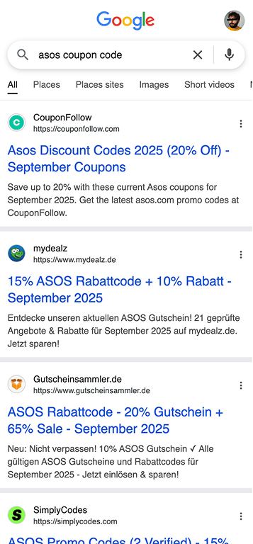
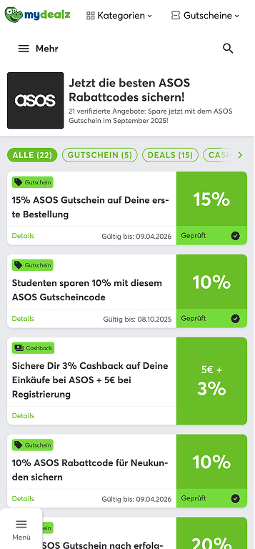
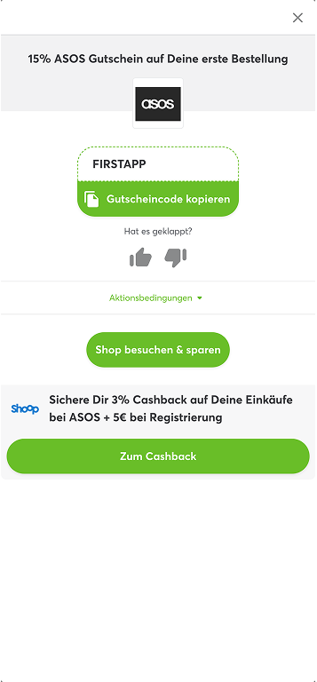
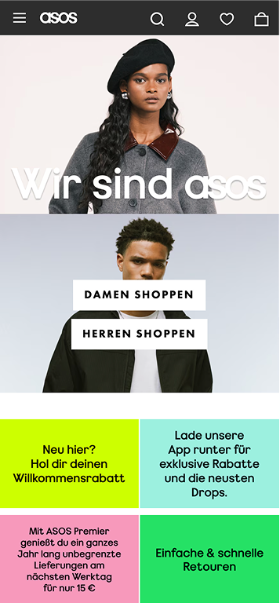

# Atolls Conversion Growth

At Atolls, formerly Global Savings Group, we built a white-label coupon and deal platform in partnership with over 50 well-known publishers.

The goal was simple: help users save money on online shopping while driving revenue for both retailers and publishers.

Our pages lived within the trusted domains of major publications, adopting each brand’s look and feel to preserve user trust and increase engagement.  

 

| CTR Increase | Sessions Tested | Brands |
|---:|---:|---:|
| 8% | +364K | 50+ |

## The Business Model in a Nutshell

- **GSG:** Provided the platform and technology
- **Publishers:** Supplied the audience and trust
- **Retailers:** Offered the deals
- **Users:** Found discounts and saved money

It worked beautifully. Everyone was winning, until Google’s policy changes killed the model.

## The User Journey

Picture this:

A user wants new shoes, Googles for a coupon, lands on our publisher-branded page, grabs a deal, clicks through, and, if the voucher works, never looks back.

Our only shot at revenue was that single click on the offer.

A razor-thin window for conversion.

| Google Search&nbsp;&nbsp;&nbsp;&nbsp; | Landing Page / Conversion Point (Redesign Task) | Post Click-out&nbsp;&nbsp;&nbsp;&nbsp;&nbsp;&nbsp;&nbsp; | Retailer&nbsp;&nbsp; |
|---|---|---|---|
|  |  |  |  |

## The Challenge: Modernize Without Sacrificing Revenue

When the design team was tasked with a full visual overhaul, I led the project.

The brief was clear:

- Modernize the experience
- Keep it on-brand for each publisher
- Most critically, do not let the conversion rate slip

Even a tiny drop would mean a big hit to revenue.

## How We Tackled It

We started with a creative workshop, suspending all constraints.

Our blue-sky approach generated fresh concepts, but business needs kept us grounded. Every card needed to show:

- Offer value
- Description, mostly for SEO
- Terms of use
- Expiration date

Research told us users cared most about the offer’s value and the terms that could make or break the deal, such as “new users only.”

We also had legacy assumptions to test:

- More deals in the first fold means better conversion
- CTA buttons drive higher conversion

This was our chance to challenge everything.

Some concepts removed the CTA button entirely and focused on visual cues and offer prominence instead.

## Design Iterations and User Testing

We landed on three main variants:

### 1. Value-forward card

Big, bold offer value, right-aligned, with no button.

### 2. Arrow cue

Offer value left-aligned, with an arrow implying clickability.

### 3. Classic CTA

Standard call-to-action button.

We added hover effects to signal interactivity on buttonless cards and tested a grid layout to fit more offers above the fold.

Tags like “App Only” or “Students” highlighted key terms upfront.

After preference tests and interviews, we put our finalists in a large-scale A/B test.

## What We Learned

Our structured experimentation showed:

- **8% CTR uplift** as the primary metric
- **10% E2V uplift** as the secondary metric
- The best-performing variant used an arrow cue in a grid layout

Other findings:

- Buttonless designs outperformed the control, except in Germany, where the CTA still won
- Users found terms easier to scan, especially with upfront tags
- The grid drove more filter clicks, suggesting users needed help narrowing choices
- All new variants beat the old design on conversion

## Iteration and Personalization

With the new flexible card structure, we could easily tweak layouts for each publisher or market.

This helped us optimize for regional preferences and brand guidelines, making the platform more adaptable and data-driven.

## Looking Back

If I had another chance, I would push for an even faster and more iterative approach.

I would experiment with smaller changes and measure their impact in real time.

We hit our goal with the resources we had, but the pace meant we could not fully isolate which changes moved the needle most.

Next time, I would aim for tighter feedback loops and more granular testing, so we could double down on what really works and learn more from the process.