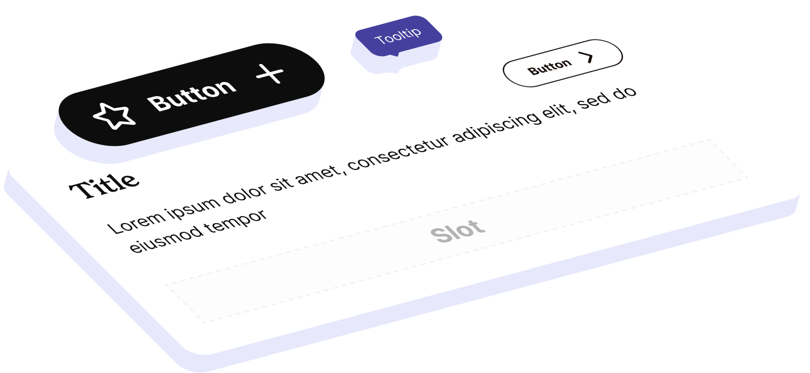

# Atolls Design System


<br>
Rebuilding an outdated design system in under two months to support a new brand identity, making it scalable, accessible, and in sync with code. The new system enables rapid updates, multi-brand adoption, and faster delivery with AI and MCP integration.  
<br>

| Faster dev cycles | Products supported | Adoption |
|---:|---:|---:|
| +50% | 4 | 75% |

## Case Study

We had a design system. So why did we need a new one?

It worked for a few years. Did the job. But just like a paper map, its time was over. Are paper maps still a thing?

Our products were basically designed around the design system, not the other way around. It wasn’t scalable. It wasn’t built for what we needed. We knew the cracks were there, but when the brand design team rolled out a shiny new brand identity, everything came crashing to the surface.

## The Breaking Point

On paper, the ask was simple: update the products to match the new brand. Rounded buttons in a distinct color. Easy, right?

Wrong.

The buttons in our design system were locked to the brand’s primary color. They literally refused another color. And that was just one example.

The system was based on TokensStudio tokens, which didn’t play nicely with Figma variables. Adding tokens? Nightmare. Any change? Took weeks to reach the code. Applying a theme in Figma? Go make a coffee, or three.

The new brand wasn’t just a visual refresh. It forced us to admit the system was done.

## The Challenge

I got the task of leading the redesign. Luckily, I wasn’t alone: another product designer and a design engineer joined me, and we had support from engineering.

The wishlist was ambitious:

- Mobile-friendly
- Accessible
- Scalable
- Fast-growing and reliable
- Easy to use
- In sync with code

The deadline? Less than two months. Don’t ask.

## Kickoff: Ruthless Prioritization

We started with a workshop. All product designers in the room, figuring out: what do we actually need in two months, and what can wait?

Example: no date pickers. We don’t even use them in our products.

Meanwhile, engineers and our design engineer explored the backend: how to link Figma variables to code, and how AI and MCP could give us some speed boosts.

We dumped everything on the table: colors, typography, grids, dimensions, icons. We spotted repeating patterns and flagged which ones should move into the system.

Priorities: locked.

## Building the Proof of Concept

Right there in the workshop, I spun up a scrappy version of the new design system. Nothing fancy, just basic elements styled with the new brand, every property tied to a variable. Designers could immediately start messing around and testing visuals.

It wasn’t the final system. It was a proof of concept. A way to keep product design moving while the real system took shape.

Meanwhile, the brand team made their own tweaks to ensure the new look would actually work for products. Everything was moving in parallel.

Initial component drafts were built within a day or so to get feedback as soon as possible.

## Iteration in Motion

Next came refinement. Research best practices. Adjust. Test. Get feedback. Adjust again.

Color ramps, typography scales, grid systems, we rebuilt the foundation piece by piece. Accessibility and scalability? Always top of the list.

Variables made the magic happen. By layering semantic tokens, we kept things abstract enough to scale. Value pools fed into brand layers, which fed into semantics, which finally fed into patterns.

That meant fewer variables overall and the ability to swap entire brands by just switching the brand layer.

```text
Value Pool → Brand Layer → Semantics → Patterns
```

Once the framework was solid, we designed the actual elements, assigned component-specific tokens, and handed them to developers with full documentation, all states defined, and expectations set.

## Delivery

Long story short: we delivered.

Elements now have different appearances, emphasis, sizes, and can adopt new brands on the fly. Components accept children. The system keeps growing, with more complex patterns being added all the time.

It all lives in one central, documented library, ready for anyone across products to grab and use.

We set up channels for feedback and updates. The workflow means updates can roll out in as little as a week.

Developers can now consume the library using AI and MCP, building features more than 50% faster than ever.

## Lessons Learned

A design system is never finished. It’s alive. It grows with the products.

The old design system worked for its time. The new one? It’s built to scale, adapt, and move at the speed our products need.

Most importantly, it’s no longer a blocker. It’s an enabler.
