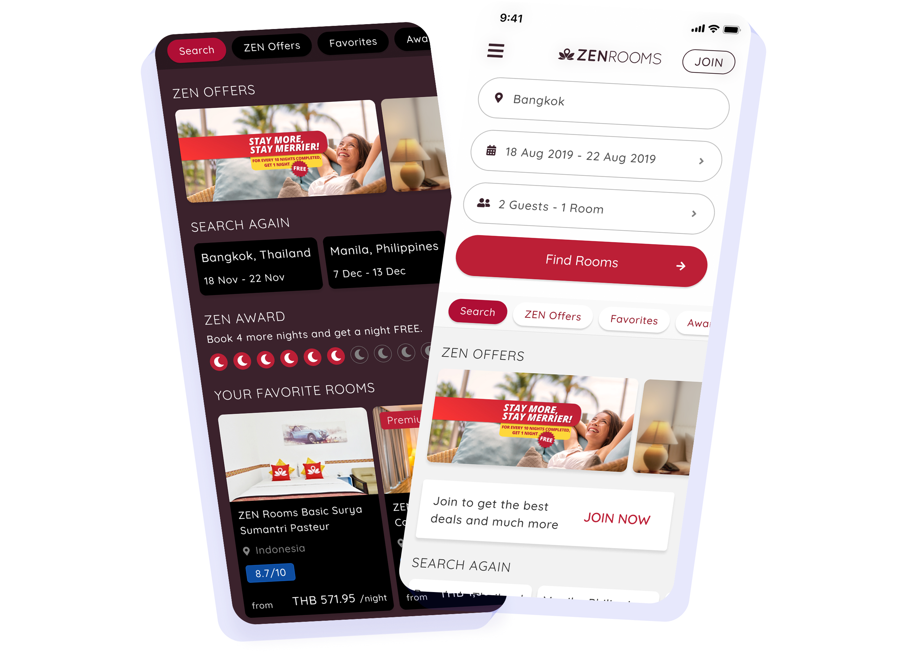

# ZENRooms App

## Overview

ZENRooms was a full-service budget and mid-range hospitality group in Southeast Asia. It served thousands of guests across the region before shutting down operations.

| Native App Design | Solo Design Sprint | Mobile Platforms |
|---:|---:|---:|
| 0→1 | 1 Month | iOS, Android |

## Case Study 

ZENRooms already had a web product that was doing well. The “app” at that point was just a web-view wrapper rendering the mobile website inside a shell.

As you can imagine, that came with a lot of baggage:

- No persistent login
- No saved preferences
- Slower load times
- An experience that did not feel like a real app

The goal was clear: turn this into a proper native product on iOS and Android.

Not a redesign for its own sake, but a real upgrade that used what the platform actually offered.

At the same time, we had an existing user base that knew the brand, so familiarity mattered. We kept the design language intact and focused on making everything feel smoother and more personal.

## The Opportunity

Moving away from a web wrapper was not just a technical change.

It opened up things that were never possible before:

- Keeping users logged in
- Storing search history and preferences on the device
- Pre-filling checkout with saved information
- Using native performance to make interactions feel instant

For a hospitality product where returning guests are a core audience, these were not nice-to-haves.

A user who has to log in from scratch and re-enter their details every time has no reason to prefer the app over just opening a browser.

Fixing that was the foundation everything else was built on.

## Design Approach

This was a 0→1 project.

No prior native app existed, so there was no legacy to work around. Just a blank canvas with clear constraints.

I worked solo across the full month, covering the entire experience from search and browse to account and checkout.

The two main principles were:

- Keep it familiar for existing users
- Use native properly

That meant leaning into platform conventions, designing for touch from the start, and not just copying the web layout into smaller frames.

Prototypes were tested on real devices through guerrilla testing to validate flows before anything went to handoff.

## Loyalty and Retention

One of the biggest gaps in the old experience was that there was no real reason to have an account.

The web wrapper did not benefit from a logged-in state in any meaningful way.

In the native app, login became the foundation for everything.

Saved preferences, search history, and a personalized experience gave users a reason to come back and stay.

For returning guests especially, the app should feel like it already knows them, because it does.

## Checkout Overhaul

The checkout flow was the most important thing to get right.

On the web, it was one of the main points of drop-off.

In the app, having the user logged in changed everything:

- We could pull stored user information
- We could skip redundant steps
- We could get users to confirmation faster

The result was a checkout that felt frictionless for returning guests.

Less re-entering data. Fewer steps. A booking success state that actually felt like a moment worth having.

## Outcome

The app design was completed in one month as a solo designer and handed off as the initial phase of the native product.

The flows were validated through guerrilla testing on real devices and prototypes. This confirmed the new experience was meaningfully faster and easier than the web-view version it replaced.

The related web redesign, done earlier and tested at scale, showed what fixing the funnel can do:

- **16% conversion uplift** across **10K+ sessions**
- Individual flow points reached **20% to 38% uplift**

The native app was designed to go further by using what the web never could.

[See Prototype]()

When you stop working around the platform and actually use it, everything gets better, for users and for the business.