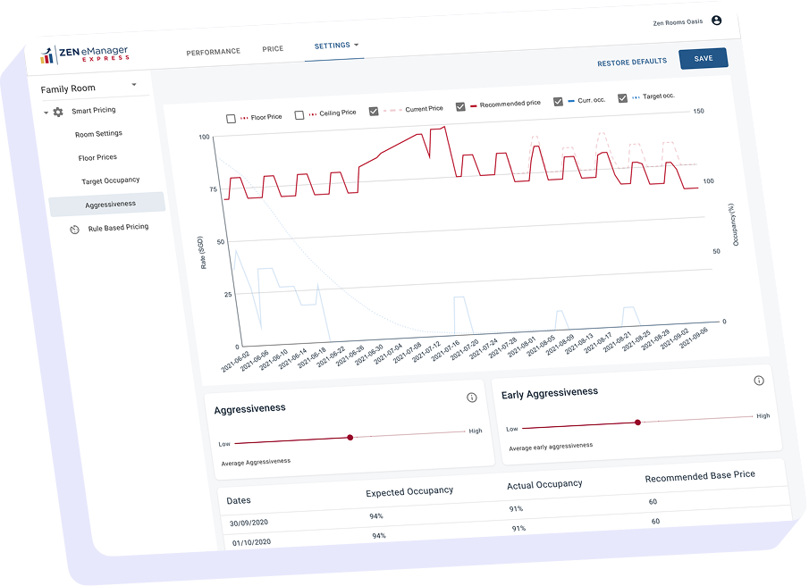
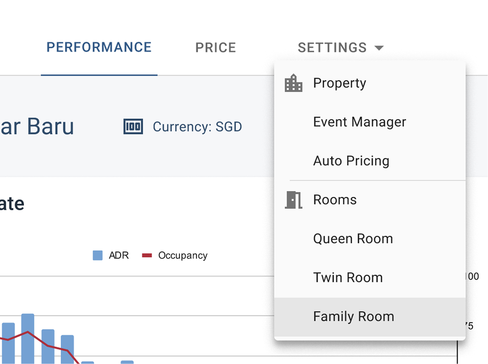
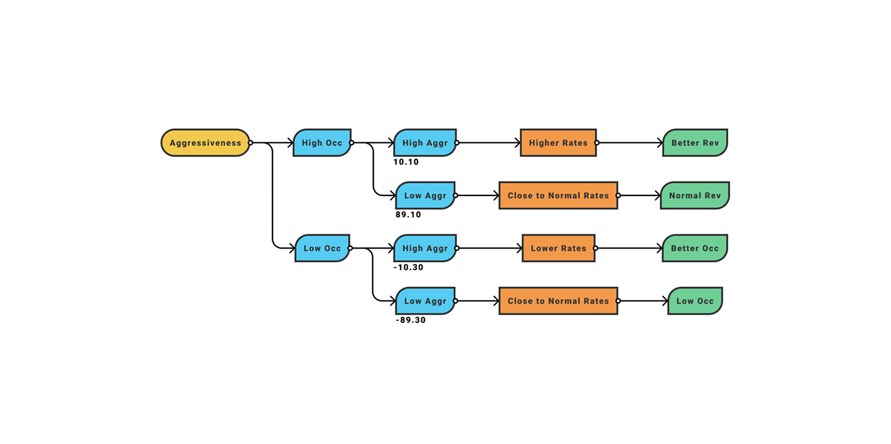
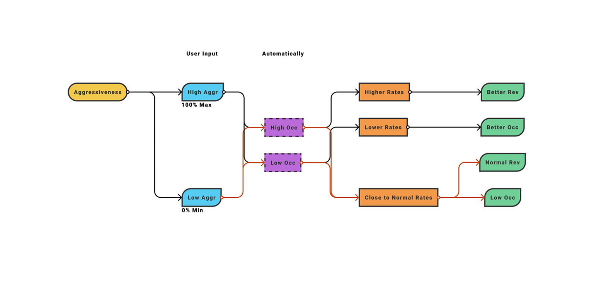
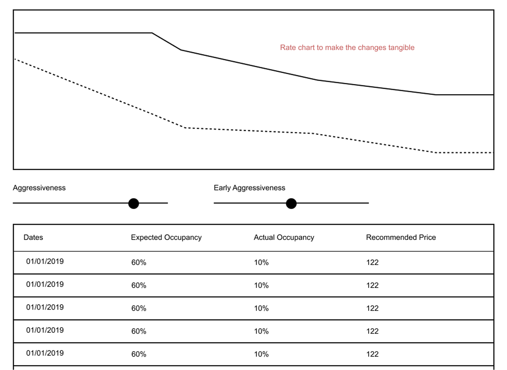
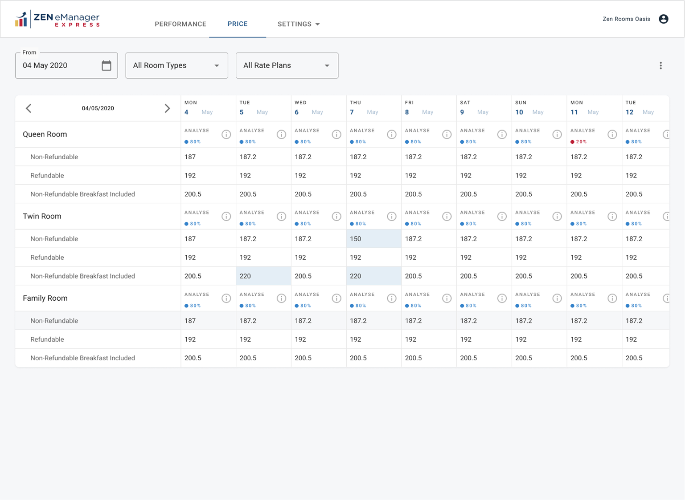
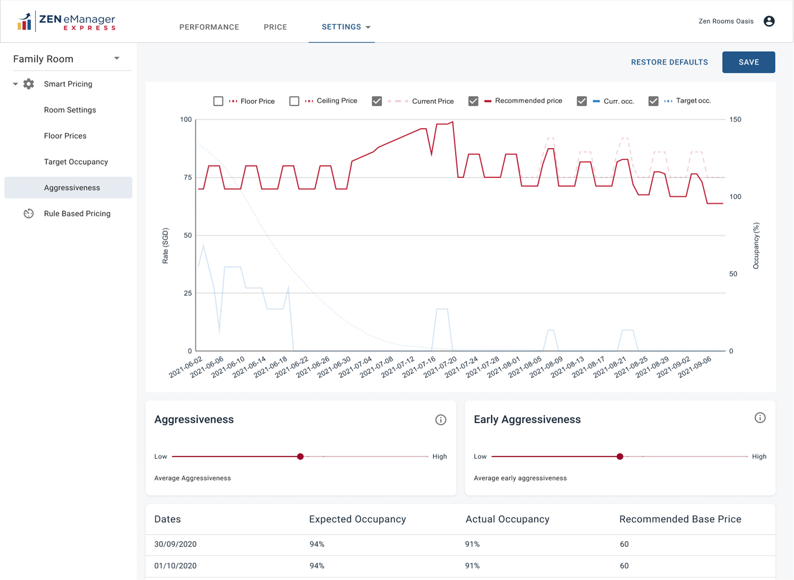
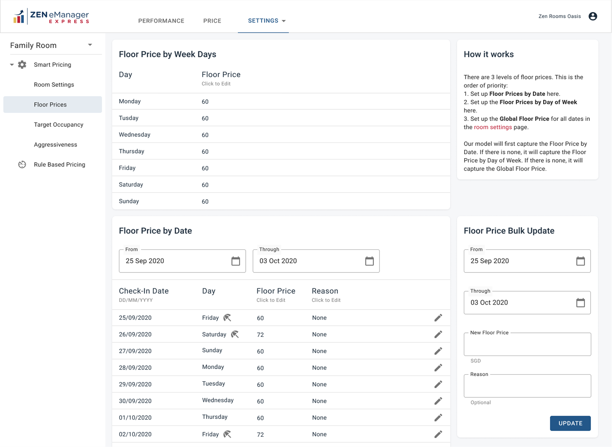
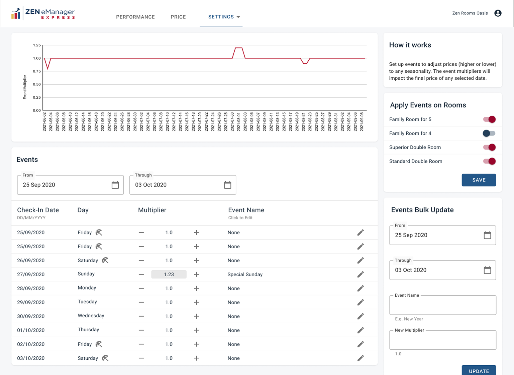

# Hotel Revenue Management System

## Overview

At ZENRooms, we developed an algorithm to maximize hotel occupancy and revenue by taking multiple variables into consideration.

The algorithm was already being used by our internal team of experts to help hoteliers with their day-to-day price management.

The next step was to put this tool directly into the hands of the hoteliers themselves.

That is where the real challenge started.

My responsibilities included:

- Identifying and creating intuitive user flows
- Creating low-fidelity and high-fidelity designs
- Building prototypes
- Managing the product from start to end

[See Prototype](https://www.figma.com/proto/oxDI7LyKHPeGeDao3NMu7J/eManager-Express)

| New Tool | MVP Delivery | Initial Hotels |
|---:|---:|---:|
| 0→1 | 3 Months | 100+ |

## The Challenge

The number of variables behind the algorithm was significant.

Creating a control panel that exposed enough control to hoteliers, while still being easy to use, became the main design challenge.

By breaking down the use cases, we identified three main components for the app:

**1. Statistics**  
Where the hotelier could see the performance of the property.

**2. Everyday Tasks**  
Where they could manually set prices for specific days when needed.

**3. Setup**  
Where they could configure the variables for the algorithm.

In the product, these became:

- **Performance:** Statistics
- **Price:** Everyday tasks
- **Settings:** Property setup

## Understanding the System

Understanding the algorithm and the math behind it was a big part of isolating the complexity and simplifying the process.

This meant introducing automated models and replacing complicated inputs with simpler controls.

A big part of the process was talking to users and stakeholders to gather as much information as possible.

This needed a deep understanding of the technology. I even got into the math.

## Simplifying Pricing Aggressiveness

One of the main challenges was creating an interface for the concept of “aggressiveness” in pricing.

The original formula used numbers and variables that the system needed to calculate prices, but the inputs were confusing for users.

After analysis and discussion, we moved many of these inputs into the background and automated as much of the process as possible.

In the end, we reduced the control from many complicated inputs to two sliders.

Pricing aggressiveness control before flow optimization  

Pricing aggressiveness control after flow optimization  

Exploring how this could become an intuitive experience

## Design System and Delivery

The next step was to introduce a simple design system that we could use to implement the product as fast as possible.

Understanding the limitations of our resources and technology, we decided to use Google’s Material Design system.

It gave us flexibility, availability, and form controls that worked well for a product with many settings and inputs.

## User Interface Design

After establishing the basics, we moved into prototyping and user testing.

[See Prototype](https://www.figma.com/proto/oxDI7LyKHPeGeDao3NMu7J/eManager-Express)

Pricing panel

Aggressiveness settings

Minimum pricing settings

Pricing for special dates

## Outcome

The project was delivered in about three months of design and development as an MVP.

We launched it with the initial hotel group and started gathering usage data and feedback for future iterative improvements.